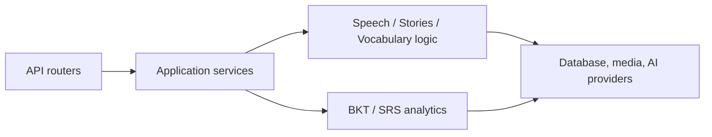

# Backend Architecture and Naming Plan

**Status:** `[C2C:PLAN]`

## 1. Mục tiêu

Tổ chức lại backend để:

- Tên folder và file mô tả đúng trách nhiệm.
- Loại bỏ `part_001.py`, `part_002.py` và dependency phụ thuộc thứ tự tên file.
- Mỗi module có một lý do thay đổi chính.
- Giữ nguyên toàn bộ API contract, BKT, quiz, pronunciation và tone-scoring behavior.
- Cho phép refactor từng giai đoạn, không cần big-bang rewrite.

## 2. Vấn đề hiện tại

Các facade như:

- `main.py`
- `chinese_tones.py`
- `praat_analyzer.py`
- `routers/stories.py`
- `routers/vocab_quiz.py`

đang gọi `_module_loader.py` để `exec` tuần tự `part_*.py`.

Điều này khiến:

- `part_004.py` không nói được file làm gì.
- Thứ tự số trở thành dependency graph ngầm.
- IDE khó theo dõi import, symbol và type.
- Việc xóa hoặc chèn một part có thể thay đổi runtime behavior.
- Test bị chia theo kích thước thay vì behavior.

Ngoài ra:

- `models.py` chứa gần 500 dòng schema không cùng domain.
- `models/` lại chứa binary model `tone_scorer.joblib`, dễ nhầm với Pydantic models.
- `services/asr.py`, `services/ai_feedback.py` và `services/speech_analysis.py` đang quá lớn.
- `pronunciation/` hiện là package nghiên cứu, không nên trộn production scoring vào đây.

## 3. Naming rules

### Folder

- Dùng `snake_case`.
- Folder biểu thị domain hoặc layer: `speech`, `stories`, `vocabulary`, `schemas`, `repositories`.
- Không dùng `parts`, `common`, `misc`, `stuff`.
- `helpers` chỉ giữ hàm nhỏ, thuần và dùng bởi nhiều domain. Logic nghiệp vụ phải trở về domain tương ứng.

### File

Tên file theo mẫu:

```text
<domain>_<responsibility>.py
```

Ví dụ:

```text
recording_quality.py
content_matching.py
pronunciation_mastery.py
story_quiz_materials.py
vocabulary_attempts.py
bkt_question_validation.py
```

Không dùng:

```text
part_001.py
utils.py
helpers.py
manager.py
processor.py
service.py
new.py
final.py
```

### Trường hợp được dùng số

Chỉ dùng số khi nó có ý nghĩa nghiệp vụ hoặc thứ tự bắt buộc:

- Alembic revision.
- Lesson number như `import_lessons_6_to_8.py`.
- Versioned data format.
- Database bootstrap có thứ tự thực sự.

Không dùng số để chia file vì file đã quá dài.

## 4. Target structure

```text
backend/
├── main.py
│
├── application/
│   ├── app_factory.py
│   ├── lifespan.py
│   ├── logging_config.py
│   ├── middleware.py
│   ├── router_registry.py
│   └── analysis_capacity.py
│
├── api/
│   ├── routers/
│   │   ├── speech_analysis.py
│   │   ├── transcription.py
│   │   ├── story_crud.py
│   │   ├── story_quiz_materials.py
│   │   ├── vocabulary_attempts.py
│   │   ├── vocabulary_mastery.py
│   │   ├── vocabulary_analytics.py
│   │   ├── students.py
│   │   ├── teachers.py
│   │   ├── submissions.py
│   │   ├── media.py
│   │   └── health.py
│   │
│   └── schemas/
│       ├── speech_analysis.py
│       ├── stories.py
│       ├── vocabulary_quiz.py
│       ├── accounts.py
│       ├── submissions.py
│       └── support.py
│
├── services/
│   ├── speech/
│   │   ├── analysis_pipeline.py
│   │   ├── recording_quality.py
│   │   ├── content_matching.py
│   │   ├── pronunciation_mastery.py
│   │   ├── text_normalization.py
│   │   │
│   │   ├── asr/
│   │   │   ├── transcription_dispatch.py
│   │   │   ├── silence_detection.py
│   │   │   ├── openai_transcription.py
│   │   │   ├── gemini_transcription.py
│   │   │   ├── groq_transcription.py
│   │   │   ├── ct_whisper_transcription.py
│   │   │   └── vibevoice_transcription.py
│   │   │
│   │   ├── acoustics/
│   │   │   ├── audio_features.py
│   │   │   ├── pause_fluency.py
│   │   │   ├── syllable_alignment.py
│   │   │   ├── word_prosody.py
│   │   │   ├── phrase_rescue.py
│   │   │   └── prosody_feedback.py
│   │   │
│   │   ├── tones/
│   │   │   ├── reference_contours.py
│   │   │   ├── pinyin_tones.py
│   │   │   ├── syllable_scoring.py
│   │   │   ├── phrase_scoring.py
│   │   │   └── tone_feedback.py
│   │   │
│   │   └── feedback/
│   │       ├── feedback_dispatch.py
│   │       ├── feedback_quality_gate.py
│   │       ├── local_feedback.py
│   │       ├── openai_feedback.py
│   │       ├── gemini_feedback.py
│   │       └── groq_feedback.py
│   │
│   ├── stories/
│   │   ├── story_repository.py
│   │   ├── story_lifecycle.py
│   │   ├── quiz_materials.py
│   │   └── image_generation.py
│   │
│   └── vocabulary/
│       ├── quiz_attempts.py
│       ├── mastery_queries.py
│       ├── review_queue.py
│       └── frex_analytics.py
│
├── analytics/
│   ├── bkt/
│   │   ├── model.py
│   │   ├── response_normalization.py
│   │   ├── mastery_repository.py
│   │   ├── mastery_rebuild.py
│   │   ├── question_eligibility.py
│   │   ├── diagnostic_design.py
│   │   └── production_audit.py
│   ├── srs/
│   └── knowledge_tracing/
│       ├── records.py
│       ├── bkt_model.py
│       ├── pfa_model.py
│       └── evaluation.py
│
├── infrastructure/
│   ├── database/
│   │   ├── connection.py
│   │   └── migrations/
│   ├── media/
│   └── model_artifacts/
│       └── tone_scorer.joblib
│
├── research/
│   └── pronunciation/
│
├── scripts/
└── tests/
    ├── unit/
    ├── integration/
    ├── contract/
    └── fixtures/
```

## 5. Mapping các file hiện tại

| Hiện tại | Đích | Trách nhiệm |
|---|---|---|
| `_module_loader.py` | Xóa | Không còn `exec` source part |
| `main_parts/part_001.py` | `application/*`, `api/routers/media.py`, schema tương ứng | App creation, logging, middleware, lifecycle và upload route |
| `main_parts/part_004.py` | `application/analysis_capacity.py` | Semaphore và admission queue |
| `main_parts/part_010.py` | `application/router_registry.py`, `api/routers/frontend.py` | Đăng ký router và phục vụ frontend |
| `services/speech_analysis.py` | `services/speech/analysis_pipeline.py` | Điều phối một speech-analysis request |
| `services/content_verification.py` | `recording_quality.py` và `content_matching.py` | Tách audio QC khỏi content comparison |
| `services/pronunciation_scoring.py` | `services/speech/pronunciation_mastery.py` | Sentence-level pronunciation result |
| `services/text_normalization.py` | `services/speech/text_normalization.py` | Chuẩn hóa transcript |
| `services/asr.py` | `services/speech/asr/*` | Dispatch và từng provider adapter |
| `services/ai_feedback.py` | `services/speech/feedback/*` | Quality gate, local feedback và provider adapters |
| `chinese_tones_parts/*` | `services/speech/tones/*` | Contour, pinyin, tone score và feedback |
| `praat_analyzer_parts/*` | `services/speech/acoustics/*` | Acoustic extraction, alignment, prosody và phrase rescue |
| `routers/stories_parts/*` | `story_crud.py`, `story_quiz_materials.py` | Tách CRUD khỏi quiz-material editing |
| `routers/vocab_quiz_parts/*` | `vocabulary_attempts.py`, `vocabulary_mastery.py`, `vocabulary_analytics.py` | Tách attempt, mastery và FREX |
| `models.py` | `api/schemas/*` | Schema theo bounded context |
| `models/tone_scorer.joblib` | `infrastructure/model_artifacts/` | Tránh nhầm binary model với API schema |
| `pronunciation/` | `research/pronunciation/` | Giữ rõ đây là research-only code |

Trong giai đoạn chuyển tiếp, `chinese_tones.py` và `praat_analyzer.py` có thể là compatibility facade dùng explicit imports:

```python
from services.speech.tones.syllable_scoring import calculate_tone_accuracy
from services.speech.tones.tone_feedback import generate_comprehensive_feedback

__all__ = [
    "calculate_tone_accuracy",
    "generate_comprehensive_feedback",
]
```

Không tiếp tục dùng `exec()` hoặc wildcard import.

## 6. File size policy

Tính toàn bộ physical lines, gồm comment và docstring.

| Loại file | Mục tiêu | Hard limit |
|---|---:|---:|
| `main.py` | 20–40 | 80 |
| App factory/lifecycle/middleware | ≤150 | 250 |
| Router | ≤200 | 300 |
| Pydantic schema | ≤250 | 400 |
| Application/service module | ≤250 | 400 |
| Provider adapter | ≤250 | 400 |
| Repository | ≤250 | 400 |
| Pure scoring/algorithm | ≤350 | 600 |
| Script | ≤250 | 400 |
| Test module | ≤400 | 600 |
| `__init__.py` | ≤30 | 50 |

Quy tắc cấp symbol:

- Endpoint handler: mục tiêu ≤40 dòng.
- Function thông thường: mục tiêu ≤50 dòng.
- Class: mục tiêu ≤250 dòng.
- Nesting tối đa 3 cấp.
- File vượt hard limit phải được tách theo trách nhiệm, không tách theo số thứ tự.
- Migration và generated code được miễn giới hạn.
- Không thay đổi scoring threshold chỉ để tách file.

## 7. Dependency direction



Các rule bắt buộc:

- Router không chứa SQL hoặc scoring logic.
- Service không import router hoặc FastAPI request objects.
- Pure tone/BKT algorithm không import database, FastAPI hoặc provider SDK.
- Provider adapter không quyết định pronunciation/BKT verdict.
- Repository không trả FastAPI response.
- Tests import module thật, không phụ thuộc `part_*.py`.

## 8. Migration order

### Phase 0 — Baseline và bảo vệ work in progress

- Giữ nguyên các thay đổi đang có trong `content_verification.py`, `pronunciation_scoring.py`, `speech_analysis.py` và `text_normalization.py`.
- Chốt baseline API paths, request/response schemas và public imports.
- Chạy toàn bộ targeted tests cho speech, quiz và BKT trước khi rename.

### Phase 1 — Loại bỏ `main_parts`

- Tạo `application/`.
- Chuyển logging, middleware, lifespan, router registration và analysis capacity.
- Chuyển `main.py` thành Uvicorn entrypoint nhỏ.
- Xóa `_module_loader.py` khi không còn consumer.

### Phase 2 — Speech production modules

- Tách `asr.py`, `ai_feedback.py`, `chinese_tones_parts` và `praat_analyzer_parts`.
- Giữ compatibility facades bằng explicit imports.
- Đây là structural refactor: không sửa threshold, verdict hoặc score formula.

### Phase 3 — API routers và schemas

- Tách `models.py` theo domain.
- Tách Stories CRUD khỏi quiz-material operations.
- Tách vocabulary attempts, mastery và analytics.
- Giữ nguyên URL, HTTP method, auth dependency và JSON field names.

### Phase 4 — Tests

Thay test part files bằng tên theo behavior:

```text
test_asr_provider_routing.py
test_asr_openai_provider.py
test_asr_gemini_provider.py
test_asr_ct_whisper_provider.py
test_speech_analysis_endpoint.py
test_analysis_processing_trace.py

test_tone_detection.py
test_tone_reference_contours.py
test_directional_tone_scoring.py
test_phrase_tone_scoring.py

test_word_prosody.py
test_phrase_rescue.py
test_connected_speech_feedback.py
test_prosody_feedback.py
```

### Phase 5 — BKT và analytics

Thực hiện cuối cùng vì regression risk cao.

- Pin output của BKT bằng golden fixtures trước khi move.
- Tách persistence, normalization, calculation và reporting.
- Không thay công thức, parameter, eligibility rule hoặc rebuild order.
- Giữ các hàm public cũ bằng compatibility exports cho đến khi mọi caller được migrate.

### Phase 6 — Architecture enforcement

Thêm:

```text
backend/ARCHITECTURE.md
backend/scripts/check_backend_architecture.py
```

CI check:

- Cấm `part_[0-9]+.py`.
- Cấm import ngược layer.
- Cảnh báo file vượt target.
- Fail khi vượt hard limit mà không có documented exception.
- Cấm production code import từ `research/`.
- Kiểm tra facade chỉ re-export explicit symbol.

## 9. Validation bắt buộc

Sau mỗi phase:

1. Import smoke test cho `main`, `chinese_tones` và `praat_analyzer`.
2. So sánh OpenAPI paths, methods và schemas trước và sau.
3. Chạy speech-analysis, pronunciation, content-verification và ASR tests.
4. Chạy toàn bộ vocabulary quiz và BKT tests.
5. Kiểm tra response payload bằng golden fixtures.
6. Xác nhận không còn `part_*.py`, `load_module_parts()` hoặc `exec()` loader.
7. Chỉ commit khi phase hiện tại pass độc lập.

## 10. Definition of Done

- Không còn numbered source-part files.
- `main.py` chỉ còn app entrypoint.
- Không có router chứa SQL, BKT hoặc pronunciation algorithm.
- Mỗi filename mô tả được công việc của file mà không cần mở source.
- API URLs và payload không thay đổi.
- Quiz, BKT, ASR và pronunciation outputs không thay đổi.
- Tone thresholds và verdict logic không bị chỉnh sửa.
- Architecture rules được kiểm tra trong CI.
