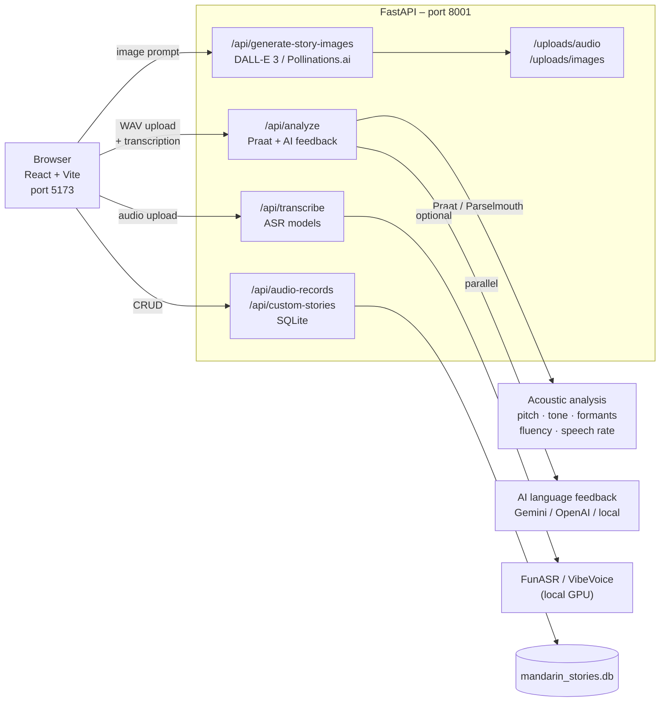

# Mandarin Stories

A classroom speaking-practice platform for Mandarin learners. Teachers build story activities with picture cues and vocabulary; students record Mandarin speech and receive acoustic + AI language feedback in real time.

---

## Application Flow


---

## Architecture



---

## Features

### Teacher tools
| Feature | Description |
|---|---|
| Story builder | Create 6-frame stories with image, student prompt, vocabulary, and word-category answer key |
| Word category editor | Assign each vocab word to Characters / Setting / Actions / Outcome for the drag-and-drop activity |
| AI image generation | Generate photorealistic scene images with DALL-E 3 or Pollinations.ai |
| Publish / unpublish | Control which stories appear in the student topic list |
| Dashboard | Class stats, help requests, progress per topic, all recordings with Praat + AI scores |
| Refresh recordings | Fetch latest student recordings from the backend without reloading the page |

### Student tools
| Feature | Description |
|---|---|
| Story Concept Map | Drag-and-drop vocab words into 4 categories; Check validates against teacher answer key |
| Scene practice | Record speech per picture cue; vocabulary chips show used ✓ / missing ✗ after analysis |
| Learning scaffold | Vocab → Coherence → Pronunciation; each step unlocks only when the previous is complete |
| Tone Drill panel | Focus characters with pitch contour shapes for targeted pronunciation practice |
| Recording playback | Listen back to your recording in the feedback panel |
| My Stories | Review all saved attempts with full Praat metrics and AI feedback |
| Raise hand | Send a help request to the teacher directly from the student view |

### Analysis pipeline
| Layer | What it measures |
|---|---|
| Praat / Parselmouth | Pitch contour, tone accuracy, formants, speech rate, fluency score, pause analysis |
| AI language coach | Vocabulary coverage (used / missing), coherence, pronunciation note, improved version |
| Tone drill | Per-word pitch shape classification (rising / falling / dipping / high-level) |

---

## Quick Start

### 1. Backend (Python 3.10+)

```powershell
cd backend
pip install -r requirements.txt
uvicorn main:app --reload --port 8001
```

Health check:
```powershell
curl http://localhost:8001/health
```

### 2. Frontend

```powershell
npm install
npm run dev -- --host 0.0.0.0 --port 5173
```

Open **http://127.0.0.1:5173**

### 3. Docker (alternative for backend)

```powershell
docker build -t mandarin-speaking-backend ./backend
docker run -d --name mandarin-api -p 8001:8001 mandarin-speaking-backend
```

---

## Environment Variables

Create `backend/.env`:

```env
# AI language feedback
GEMINI_API_KEY=your_gemini_key
OPENAI_API_KEY=your_openai_key
AI_FEEDBACK_PROVIDER=gemini          # gemini | openai | local
GEMINI_FEEDBACK_MODEL=gemini-2.0-flash
OPENAI_FEEDBACK_MODEL=gpt-4o-mini

# Image generation (for "Generate Six Picture Cues")
# Uses DALL-E 3 if OPENAI_API_KEY set, otherwise Pollinations.ai (free)

# Local ASR (optional)
FUNASR_MODEL=paraformer-zh
VIBEVOICE_ASR_MODEL=microsoft/VibeVoice-ASR-HF
VIBEVOICE_DEVICE=-1                  # -1 = CPU, 0 = first GPU

# Server
CORS_ORIGINS=http://localhost:5173,http://127.0.0.1:5173
DATABASE_PATH=./mandarin_stories.db
UPLOAD_DIR=./uploads
```

Create `.env.local` in the project root (frontend):

```env
VITE_BACKEND_URL=http://localhost:8001
```

---

## User Roles

### Teacher login
- Default password: `teacher123` (set in backend)
- Access: Dashboard, Image Builder
- Can create/publish stories, view all student recordings, resolve help requests

### Student login
- Default password: `student123`
- Access: Training (speaking practice), My Stories
- Can practice published stories, raise a hand for help

---

## Deployment

### Backend on Render

1. Push to GitHub.
2. In Render, create a new Web Service from the repository — point to `backend/Dockerfile`.
3. Set environment variables including:
   ```
   CORS_ORIGINS=https://your-frontend-domain.com
   GEMINI_API_KEY=...
   ```

### Frontend on Vercel / GitHub Pages

Set before building:
```env
VITE_BACKEND_URL=https://your-backend-domain.onrender.com
```

Then:
```powershell
npm run build
npx vercel --prod
```

---

## Project Structure

```
.
├── backend/
│   ├── ai_feedback.py        # Gemini / OpenAI / local language feedback
│   ├── chinese_tones.py      # Mandarin tone reference patterns
│   ├── database.py           # SQLite helpers
│   ├── main.py               # FastAPI routes, image generation, parallel analysis
│   ├── praat_analyzer.py     # Parselmouth acoustic analysis
│   ├── Dockerfile
│   └── requirements.txt
└── src/
    ├── components/
    │   ├── StoryConceptMap.tsx   # Drag-and-drop word categorization activity
    │   ├── StoryConceptMap.css
    │   ├── StoryRecorder.tsx     # Main recording + analysis panel
    │   ├── StoryRecorder.css
    │   ├── PraatTimeline.tsx
    │   └── Navigation.tsx
    ├── pages/
    │   ├── HomePage.tsx
    │   ├── CreateStoryPage.tsx
    │   ├── MyStoriesPage.tsx     # Student history + Teacher dashboard
    │   ├── LoginPage.tsx
    │   └── TeacherImageBuilderPage.tsx
    ├── utils/
    │   └── teacherStories.ts     # Custom story helpers, VocabGroup types
    ├── database.ts               # Frontend API client
    ├── TopicSelector.tsx
    ├── App.tsx
    └── main.tsx
```

---

## API Reference

| Method | Endpoint | Description |
|---|---|---|
| `GET` | `/health` | Backend status |
| `POST` | `/api/analyze` | WAV upload → Praat + AI feedback |
| `POST` | `/api/transcribe` | WAV upload → transcription (openai / gemini / funasr / vibevoice) |
| `GET` | `/api/audio-records` | List all student recordings |
| `POST` | `/api/audio-records/upload` | Save a recording with audio file |
| `DELETE` | `/api/audio-records/{id}` | Delete a recording |
| `GET` | `/api/custom-stories` | List teacher stories |
| `POST` | `/api/custom-stories` | Create / update a story |
| `DELETE` | `/api/custom-stories/{id}` | Delete a story |
| `POST` | `/api/generate-story-images` | Generate 6 picture cues with AI |
| `GET` | `/api/reference-tone/{tone}` | Mandarin tone reference (1–4) |
| `GET` | `/api/all-tones` | All tone reference patterns |

---

## Praat Metrics

| Metric | Description |
|---|---|
| Tone accuracy | Similarity of pitch contour to Mandarin tone references |
| Fluency score | Smoothness and continuity from pitch and timing |
| Speech rate | Estimated syllables per second |
| Pitch contour | Frequency over time (Hz) |
| Formants F1 / F2 / F3 | Vowel resonance characteristics |
| Pause analysis | Utterance count, pause count, longest pause, speech ratio |
| Word prosody | Per-word pitch shape: rising / falling / dipping / high-level |

---

## Troubleshooting

**`ERR_CONNECTION_REFUSED` on backend** — start the backend and verify `VITE_BACKEND_URL=http://localhost:8001` in `.env.local`.

**AI feedback shows `provider: local`** — no Gemini or OpenAI key configured; add one to `backend/.env` and restart.

**Images not showing in teacher materials** — relative `/uploads/` paths must be resolved through the backend URL. The app handles this automatically via `resolveImageUrl()`.

**Concept map check shows no feedback** — the teacher must assign words to categories in the Materials form before publishing. Without an answer key, Check only counts placed words.

**Student recordings not visible in teacher dashboard** — click **↺ Refresh recordings** in the dashboard header to re-fetch the latest records from the database.

---

## License

MIT
