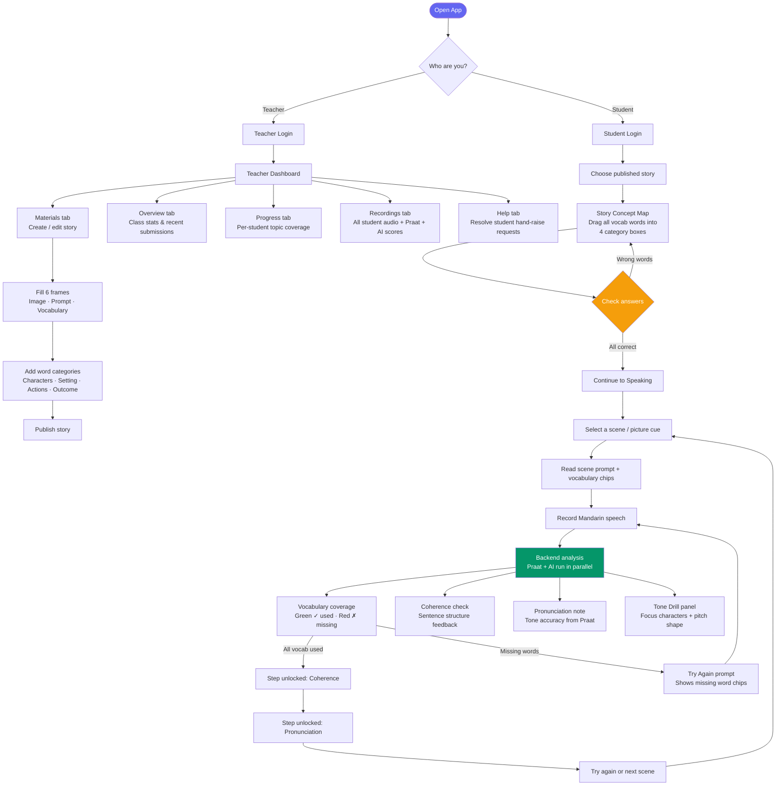
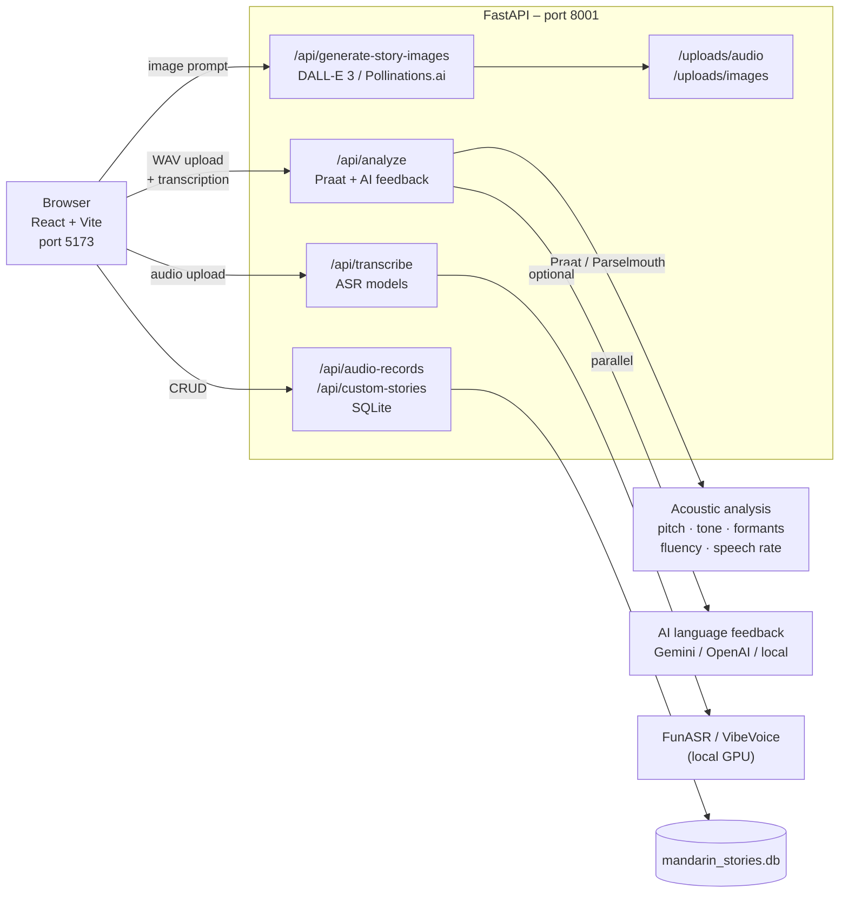
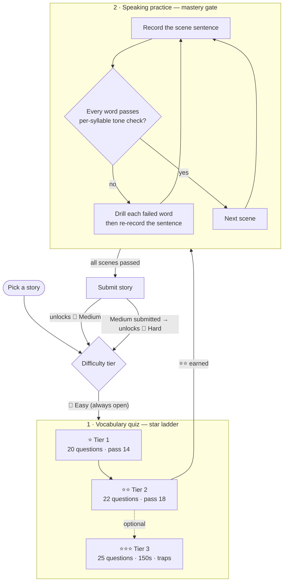

# Enjoyable Mandarin

A classroom speaking-practice platform for Mandarin learners. Teachers build story activities with picture cues and vocabulary; students record Mandarin speech and receive acoustic + AI language feedback in real time.

---

## Application Flow



---

## Architecture



---

## Features

### Teacher tools
| Feature | Description |
|---|---|
| Story builder | Create 6-frame stories with image, student prompt, vocabulary, and word-category answer key |
| Word category editor | Assign each vocab word to Characters / Setting / Actions / Outcome for the drag-and-drop activity |
| AI image generation | Generate photorealistic scene images with DALL-E 3 or Pollinations.ai |
| Publish / unpublish | Control which stories appear in the student topic list |
| Export / Import story | Download a story as a single file and load it on another device — see [Exporting & Importing Stories](#exporting--importing-stories) |
| Dashboard | Class stats, help requests, progress per topic, all recordings with Praat + AI scores |
| Refresh recordings | Fetch latest student recordings from the backend without reloading the page |

### Student tools
| Feature | Description |
|---|---|
| Story Concept Map | Drag-and-drop vocab words into 4 categories; Check validates against teacher answer key |
| Scene practice | Record speech per picture cue; vocabulary chips show used ✓ / missing ✗ after analysis |
| Learning scaffold | Vocab → Coherence → Pronunciation; each step unlocks only when the previous is complete |
| Tone Drill panel | Focus characters with pitch contour shapes for targeted pronunciation practice |
| Recording playback | Listen back to your recording in the feedback panel |
| My Stories | Review all saved attempts with full Praat metrics and AI feedback |
| Raise hand | Send a help request to the teacher directly from the student view |

### Analysis pipeline
| Layer | What it measures |
|---|---|
| Praat / Parselmouth | Pitch contour, tone accuracy, formants, speech rate, fluency score, pause analysis |
| AI language coach | Vocabulary coverage (used / missing), coherence, pronunciation note, improved version |
| Tone drill | Per-word pitch shape classification (rising / falling / dipping / high-level) |

### Feedback dimensions & the technology behind each

Every recording is scored across several dimensions. Some are **deterministic** acoustic
measurements (pure signal processing — same audio always yields the same number); others are
**AI** judgments from a language model. The table below maps each dimension to the engine that
produces it.

| Dimension | What it measures | Engine | Deterministic / AI |
|---|---|---|---|
| **Transcription (ASR)** | Speech → Mandarin text | Browser **Web Speech API** (default, Traditional Chinese) · or server ASR: **CT-Whisper** (`openai/whisper-small`), **FunASR** (`paraformer-zh`), **VibeVoice-ASR** (`microsoft/VibeVoice-ASR`) · or cloud (OpenAI / Gemini) | Model-dependent |
| **Tone accuracy** | How closely the pitch melody matches a Mandarin tone shape | **Praat / Parselmouth** pitch extraction → correlation (65%) + distance (35%) vs reference tone patterns (`chinese_tones.py`) | Deterministic |
| **Pitch contour & word prosody** | F0 over time; per-syllable rising / falling / dipping / level shape | **Praat / Parselmouth** | Deterministic |
| **Formants (F1 / F2 / F3)** | Vowel quality / resonance | **Praat / Parselmouth** formant tracking | Deterministic |
| **Speech rate** | Syllables per second | Character count ÷ utterance duration (**Praat**) | Deterministic |
| **Fluency** | Speaking fluency | **Praat** utterance fluency — phonation-time ratio, articulation rate, mean length of run (`caf_metrics.py`) + pitch-continuity term | Deterministic |
| **Pauses & utterances** | Pause count, longest pause, speech ratio | **Praat** intensity-based silence detection | Deterministic |
| **Vocabulary coverage** | Scene-word coverage + lexical richness | **LLM** (Gemini `gemini-2.0-flash` / OpenAI `gpt-4o-mini`) → local: task coverage blended with **lexical diversity** (Guiraud index, MTLD) | AI or CAF-local |
| **Coherence** | Grammatical completeness & clause linking | **LLM** (Gemini / OpenAI) → local: **syntactic complexity** (mean length of utterance + connective/subordination density) | AI or CAF-local |
| **Pronunciation note** | Holistic pronunciation, informed by Praat | **LLM** (Gemini / OpenAI) → local: tone-contour proxy for **Goodness of Pronunciation** + utterance-fluency notes | AI or CAF-local |
| **Improved version & practice prompt** | A model sentence + next actionable step | **LLM** (Gemini / OpenAI); local returns a targeted next-step drill | AI or CAF-local |

> The AI provider is set with `AI_FEEDBACK_PROVIDER` (`gemini` · `openai` · `local`). With no API
> key configured it falls back to `local`, so the app still runs fully offline. The local engine is
> **not** ad-hoc heuristics — the language-coaching dimensions are grounded in the
> Complexity–Accuracy–Fluency (CAF) tradition of L2 speaking assessment, computed deterministically
> in [`backend/caf_metrics.py`](backend/caf_metrics.py) (Chinese word segmentation via **jieba**).

#### References (local CAF engine)

- Skehan, P. (1998). *A Cognitive Approach to Language Learning.* OUP. — CAF framework.
- Housen, A., & Kuiken, F. (2009). Complexity, Accuracy and Fluency in SLA. *Applied Linguistics, 30*(4), 461–473.
- Towell, R., Hawkins, R., & Bazergui, N. (1996). The development of fluency in advanced learners of French. *Applied Linguistics, 17*(1), 84–119. — mean length of run.
- De Jong, N. H., et al. (2012). Facets of speaking proficiency. *SSLA, 34*(1), 5–34. — phonation-time ratio, articulation rate.
- Guiraud, P. (1960). *Problèmes et méthodes de la statistique linguistique.* — Guiraud index.
- McCarthy, P. M., & Jarvis, S. (2010). MTLD, vocd-D and HD-D: A validation study. *Behavior Research Methods, 42*(2), 381–392.
- Witt, S. M., & Young, S. J. (2000). Phone-level pronunciation scoring. *Speech Communication, 30*(2–3), 95–108. — Goodness of Pronunciation (tone-contour proxy used here).

#### Local engine: ad-hoc → paper-grounded

| Dimension | Before (ad-hoc) | Now (paper-grounded) | Technology behind the scenes | Source |
|---|---|---|---|---|
| **Vocabulary** | substring match only | task coverage blended with lexical diversity (Guiraud index, MTLD) | `jieba` word segmentation + Guiraud/MTLD in pure Python (`caf_metrics.py`) | Guiraud 1960; McCarthy & Jarvis 2010 |
| **Coherence** | character-count thresholds | syntactic complexity — mean length of utterance + connective/subordination density | `jieba` segmentation + connective lexicon, Python (`caf_metrics.py`) | Skehan 1998; Housen & Kuiken 2009 |
| **Fluency** | pitch-continuity heuristic | utterance fluency — phonation-time ratio, articulation rate, mean length of run | `praat-parselmouth` intensity/pause segmentation + NumPy (`praat_analyzer.py`, `caf_metrics.py`) | Towell et al. 1996; De Jong et al. 2012 |
| **Pronunciation** | tone threshold | tone-contour proxy for Goodness of Pronunciation + fluency notes | `praat-parselmouth` pitch extraction + NumPy/SciPy contour correlation (`chinese_tones.py`) | Witt & Young 2000 |

**Frontend rendering:** React + Vite, with **Chart.js** for the pitch-contour visualization.

---

## Student Progression & Unlock Ladder

Students never skip ahead: every stage is unlocked by measured performance, in a fixed
chain. There are three stacked quality gates — **know the words** (quiz stars), **say them
right** (pronunciation mastery), **level up the language** (story difficulty tiers).



### 1. Vocabulary quiz — the star ladder (`src/utils/quizTiers.ts`)

| Tier | Questions | Must answer right | Time limit | Character |
|---|---|---|---|---|
| ⭐ Tier 1 (第一關) | 20 | 14 (70%) | none | baseline questions |
| ⭐⭐ Tier 2 (第二關) | 22 | 18 (~82%) | none | trickier distractors |
| ⭐⭐⭐ Tier 3 (第三關) | 25 | 22 (88%) | 150 s whole run | tone traps, timed |

- Tier 1 is always open; each later tier opens once the previous star is earned
  (`isTierUnlocked`).
- Passing a tier earns its star **permanently** — a later failed run never demotes it
  (`recordLocalStars` only ever raises).
- **⭐⭐ is the gate into speaking practice** (`PRACTICE_UNLOCK_STARS = 2`): the results
  screen only shows *Continue to practice* at two stars; below that it shows a lock note
  plus *Try again* / *Challenge next tier*. Tier 3 is an optional extra challenge.
- Stars are **derived, not stored**: computed from the `vocab_quiz_attempts` history
  (`mode = tier1/2/3`, `starsFromAttempts`), so they follow the student across devices;
  a localStorage mirror (`vocabQuizStars`) gives an instant first paint and covers
  offline/no-database mode.
- Backward compatibility: students who unlocked practice under an older, looser rule
  keep their unlock (`alreadyCompleted`).

### 2. Speaking practice — the pronunciation mastery gate

Each scene recording is scored **per syllable** (directional pitch check against the
expected tone, `backend/praat_analyzer.py`): a word passes only if its *weakest* syllable
clears the bar — an average can't hide one wrong-direction tone.

- Words that fail show ✗ chips per character; the student drills each failed word alone
  (`WordPracticeDrill`), then must **re-record the whole sentence** — words first, then
  the sentence.
- *Next scene*, *View summary*, and *Submit* stay locked until the latest full-sentence
  recording passes every word; the old 4-attempts escape hatch no longer bypasses
  failing words.

### 3. Story difficulty tiers — Easy → Medium → Hard (`src/utils/storyLevelProgress.ts`)

Each teacher story is authored at three language tiers of the **same plot**. 🌱 Easy is
always open; 🌿 Medium unlocks when Easy has been **submitted**; 🌳 Hard unlocks when
Medium has been submitted (`StoryLevelPicker`). Because submission itself sits behind the
mastery gate, "submitted" always means "spoken to standard" — so tier progression is
earned by data, never by clicking through.

---

## Exporting & Importing Stories

A teacher story (its images, prompts, vocabulary, and — for Listen & Retell — listening
audio) can be saved to a single file and loaded on a different device, even one with its
own separate backend/database. This is handled entirely in the browser: exporting inlines
any server-hosted images/audio as base64 so the file has no dependency on the original
backend, and importing sends the story through the same save path as creating one by hand.

### Export (device A)

1. Log in as **Teacher** and open the **Materials** tab of the dashboard.
2. Find the story in the **Teacher Story Library** list on the right.
3. Click **Export** on that story.
4. Your browser downloads a file named `<story-title>.mandarin-story.json`. Send it to the
   other device however is convenient — USB drive, email, cloud storage, AirDrop, etc.

### Import (device B)

1. Log in as **Teacher** and open the **Materials** tab of the dashboard.
2. Click **Import story** next to the "Teacher Story Library" heading and pick the
   `.mandarin-story.json` file from step 4 above.
3. The story appears at the top of the library as a new, unpublished draft — review it,
   click **Edit** to tweak anything, then **Publish** when it's ready for students.

**Notes**

- Imported stories always land unpublished, so they never appear to students before you've
  reviewed them.
- The export is self-contained (images/audio are embedded as base64), so it works even if
  device B has no network access to device A's backend. The trade-off is file size — a
  story with several images can be a few megabytes.
- If device B is running fully offline (no backend reachable), the import still works and
  is cached in the browser's local storage, but very large exports can hit the browser's
  ~5 MB local-storage quota. Connecting device B to a backend avoids that limit.

---

## Quick Start

### 1. Backend (Python 3.10+)

```powershell
cd backend
pip install -r requirements.txt
uvicorn main:app --reload --port 8001
```

Health check:
```powershell
curl http://localhost:8001/health
```

### 2. Frontend

```powershell
npm install
npm run dev -- --host 0.0.0.0 --port 5173
```

Open **http://127.0.0.1:5173**

### 3. Docker (alternative for backend)

```powershell
docker build -t mandarin-speaking-backend ./backend
docker run -d --name mandarin-api -p 8001:8001 mandarin-speaking-backend
```

---

## Environment Variables

Create `backend/.env`:

```env
# AI language feedback
GEMINI_API_KEY=your_gemini_key
OPENAI_API_KEY=your_openai_key
AI_FEEDBACK_PROVIDER=gemini          # gemini | openai | local
GEMINI_FEEDBACK_MODEL=gemini-2.0-flash
OPENAI_FEEDBACK_MODEL=gpt-4o-mini

# Image generation (for "Generate Six Picture Cues")
# Uses DALL-E 3 if OPENAI_API_KEY set, otherwise Pollinations.ai (free)

# Local ASR (optional)
FUNASR_MODEL=paraformer-zh
VIBEVOICE_ASR_MODEL=microsoft/VibeVoice-ASR-HF
VIBEVOICE_DEVICE=-1                  # -1 = CPU, 0 = first GPU

# Server
CORS_ORIGINS=http://localhost:5173,http://127.0.0.1:5173
DATABASE_PATH=./mandarin_stories.db
UPLOAD_DIR=./uploads
```

Create `.env.local` in the project root (frontend):

```env
VITE_BACKEND_URL=http://localhost:8001
```

---

## User Roles

### Teacher login
- Default password: `teacher123` (set in backend)
- Access: Dashboard, Image Builder
- Can create/publish stories, view all student recordings, resolve help requests

### Student login
- Default password: `student123`
- Access: Training (speaking practice), My Stories
- Can practice published stories, raise a hand for help

---

## Deployment

### Backend on Render

1. Push to GitHub.
2. In Render, create a new Web Service from the repository — point to `backend/Dockerfile`.
3. Set environment variables including:
   ```
   CORS_ORIGINS=https://your-frontend-domain.com
   GEMINI_API_KEY=...
   ```

### Frontend on Vercel / GitHub Pages

Set before building:
```env
VITE_BACKEND_URL=https://your-backend-domain.onrender.com
```

Then:
```powershell
npm run build
npx vercel --prod
```

---

## Project Structure

```
.
├── backend/
│   ├── ai_feedback.py        # Gemini / OpenAI / local language feedback
│   ├── chinese_tones.py      # Mandarin tone reference patterns
│   ├── database.py           # SQLite helpers
│   ├── main.py               # FastAPI routes, image generation, parallel analysis
│   ├── praat_analyzer.py     # Parselmouth acoustic analysis
│   ├── Dockerfile
│   └── requirements.txt
└── src/
    ├── components/
    │   ├── StoryConceptMap.tsx   # Drag-and-drop word categorization activity
    │   ├── StoryConceptMap.css
    │   ├── StoryRecorder.tsx     # Main recording + analysis panel
    │   ├── StoryRecorder.css
    │   ├── PraatTimeline.tsx
    │   └── Navigation.tsx
    ├── pages/
    │   ├── HomePage.tsx
    │   ├── CreateStoryPage.tsx
    │   ├── MyStoriesPage.tsx     # Student history + Teacher dashboard
    │   ├── LoginPage.tsx
    │   └── TeacherImageBuilderPage.tsx
    ├── utils/
    │   └── teacherStories.ts     # Custom story helpers, VocabGroup types
    ├── database.ts               # Frontend API client
    ├── TopicSelector.tsx
    ├── App.tsx
    └── main.tsx
```

---

## API Reference

| Method | Endpoint | Description |
|---|---|---|
| `GET` | `/health` | Backend status |
| `POST` | `/api/analyze` | WAV upload → Praat + AI feedback |
| `POST` | `/api/transcribe` | WAV upload → transcription (openai / gemini / funasr / vibevoice) |
| `GET` | `/api/audio-records` | List all student recordings |
| `POST` | `/api/audio-records/upload` | Save a recording with audio file |
| `DELETE` | `/api/audio-records/{id}` | Delete a recording |
| `GET` | `/api/custom-stories` | List teacher stories |
| `POST` | `/api/custom-stories` | Create / update a story |
| `DELETE` | `/api/custom-stories/{id}` | Delete a story |
| `POST` | `/api/generate-story-images` | Generate 6 picture cues with AI |
| `GET` | `/api/reference-tone/{tone}` | Mandarin tone reference (1–4) |
| `GET` | `/api/all-tones` | All tone reference patterns |

---

## Praat Metrics

| Metric | Description |
|---|---|
| Tone accuracy | Similarity of pitch contour to Mandarin tone references |
| Fluency score | Smoothness and continuity from pitch and timing |
| Speech rate | Estimated syllables per second |
| Pitch contour | Frequency over time (Hz) |
| Formants F1 / F2 / F3 | Vowel resonance characteristics |
| Pause analysis | Utterance count, pause count, longest pause, speech ratio |
| Word prosody | Per-word pitch shape: rising / falling / dipping / high-level |

---

## Troubleshooting

**`ERR_CONNECTION_REFUSED` on backend** — start the backend and verify `VITE_BACKEND_URL=http://localhost:8001` in `.env.local`.

**AI feedback shows `provider: local`** — no Gemini or OpenAI key configured; add one to `backend/.env` and restart.

**Images not showing in teacher materials** — relative `/uploads/` paths must be resolved through the backend URL. The app handles this automatically via `resolveImageUrl()`.

**Concept map check shows no feedback** — the teacher must assign words to categories in the Materials form before publishing. Without an answer key, Check only counts placed words.

**Student recordings not visible in teacher dashboard** — click **↺ Refresh recordings** in the dashboard header to re-fetch the latest records from the database.

---

## License

MIT
