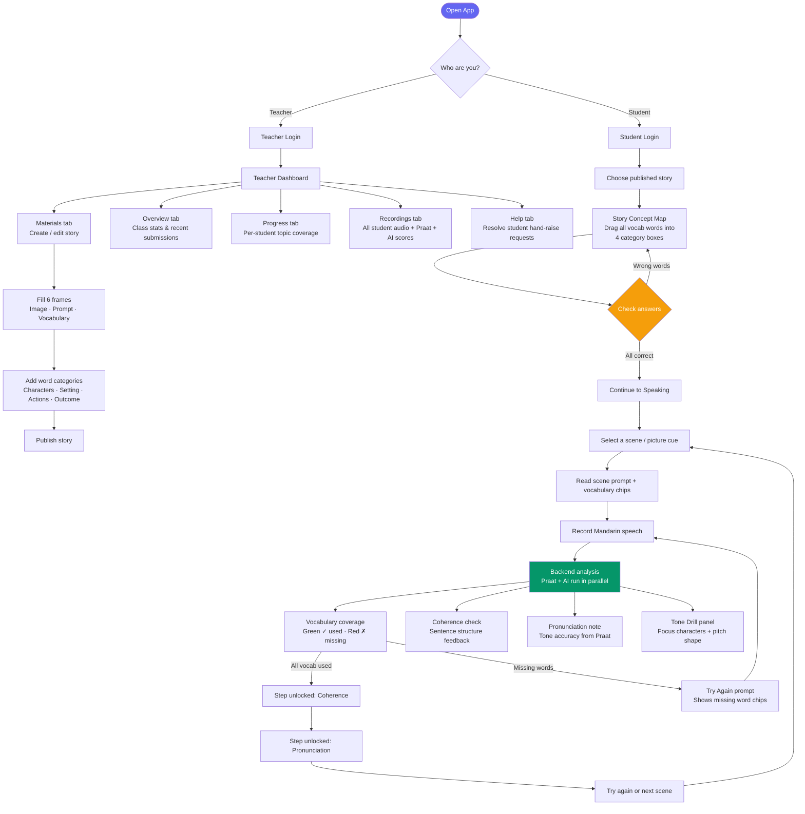
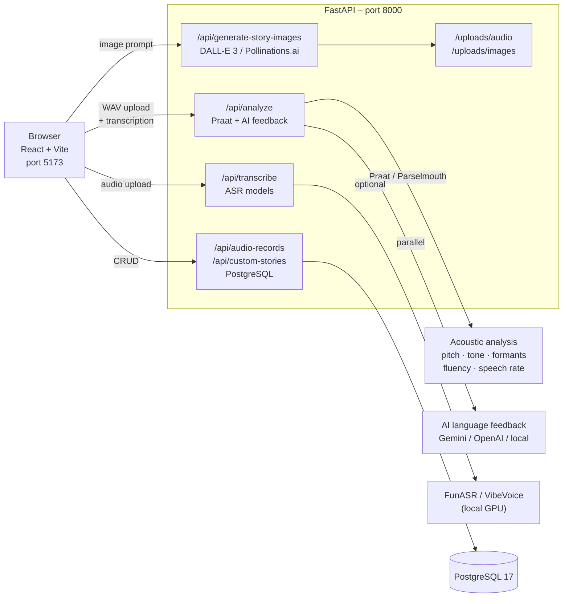
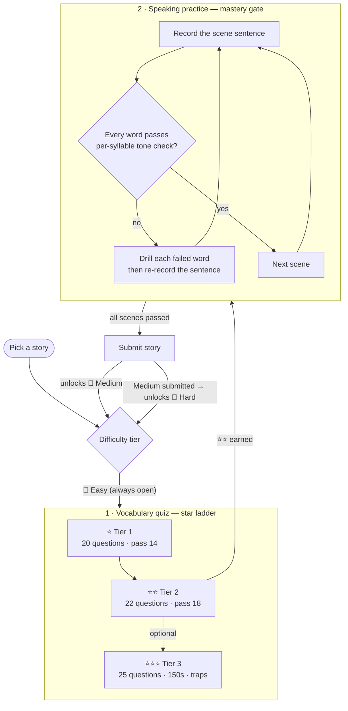

# 慢慢中文 · Mandarin, little by little

A classroom speaking-practice platform for Mandarin learners. Teachers build story activities with picture cues and vocabulary; students record Mandarin speech and receive acoustic + AI language feedback in real time.

---

## Application Flow


```mermaid
flowchart TD
    A([Open App]) --> B{Who are you?}

    B -->|Teacher| T1[Teacher Login]
    B -->|Student| S1[Student Login]

    %% ── Teacher path ──────────────────────────────────────
    T1 --> T2[Teacher Dashboard]

    T2 --> T3[Materials tab\nCreate / edit story]
    T3 --> T4[Fill 6 frames\nImage · Prompt · Vocabulary]
    T4 --> T5[Add word categories\nCharacters · Setting · Actions · Outcome]
    T5 --> T6[Publish story]

    T2 --> T7[Overview tab\nClass stats & recent submissions]
    T2 --> T8[Progress tab\nPer-student topic coverage]
    T2 --> T9[Recordings tab\nAll student audio + Praat + AI scores]
    T2 --> T10[Help tab\nResolve student hand-raise requests]

    %% ── Student path ──────────────────────────────────────
    S1 --> S2[Choose published story]
    S2 --> S3[Story Concept Map\nDrag all vocab words into\n4 category boxes]
    S3 --> S4{Check answers}
    S4 -->|Wrong words| S3
    S4 -->|All correct| S5[Continue to Speaking]

    S5 --> S6[Select a scene / picture cue]
    S6 --> S7[Read scene prompt + vocabulary chips]
    S7 --> S8[Record Mandarin speech]

    S8 --> S9[Backend analysis\nPraat + AI run in parallel]

    S9 --> S10[Vocabulary coverage\nGreen ✓ used · Red ✗ missing]
    S9 --> S11[Coherence check\nSentence structure feedback]
    S9 --> S12[Pronunciation note\nTone accuracy from Praat]
    S9 --> S13[Tone Drill panel\nFocus characters + pitch shape]

    S10 -->|All vocab used| S14[Step unlocked: Coherence]
    S14 --> S15[Step unlocked: Pronunciation]
    S15 --> S16[Try again or next scene]
    S16 --> S6

    S10 -->|Missing words| S17[Try Again prompt\nShows missing word chips]
    S17 --> S8

    style A fill:#6366f1,color:#fff
    style S4 fill:#f59e0b,color:#fff
    style S9 fill:#059669,color:#fff
```

---

## Architecture


```mermaid
flowchart LR
    Browser["Browser\nReact + Vite\nport 5173"]

    subgraph Backend["FastAPI  –  port 8000"]
        direction TB
        API["/api/analyze\nPraat + AI feedback"]
        ASR["/api/transcribe\nASR models"]
        DB["/api/audio-records\n/api/custom-stories\nPostgreSQL"]
        IMG["/api/generate-story-images\nDALL-E 3 / Pollinations.ai"]
        UPL["/uploads/audio\n/uploads/images"]
    end

    Browser -->|"WAV upload\n+ transcription"| API
    Browser -->|"audio upload"| ASR
    Browser -->|"CRUD"| DB
    Browser -->|"image prompt"| IMG

    API -->|"Praat / Parselmouth"| Praat["Acoustic analysis\npitch · tone · formants\nfluency · speech rate"]
    API -->|"parallel"| AIFeed["AI language feedback\nGemini / OpenAI / local"]
    IMG --> UPL
    ASR -->|"optional"| FunASR["FunASR / VibeVoice\n(local GPU)"]

    DB --> Postgres[(PostgreSQL 17)]
```

---

## Features

### Teacher tools
| Feature | Description |
|---|---|
| Story builder | Create 6-frame stories with image, student prompt, vocabulary, and word-category answer key |
| Word category editor | Assign each vocab word to Characters / Setting / Actions / Outcome for the drag-and-drop activity |
| AI image generation | Generate photorealistic scene images with DALL-E 3 or Pollinations.ai |
| Publish / unpublish | Control which stories appear in the student topic list |
| Export / Import story | Download a story as a single file and load it on another device — see [Exporting & Importing Stories](#exporting--importing-stories) |
| Dashboard | Class stats, help requests, progress per topic, all recordings with Praat + AI scores |
| Refresh recordings | Fetch latest student recordings from the backend without reloading the page |

### Student tools
| Feature | Description |
|---|---|
| Story Concept Map | Drag-and-drop vocab words into 4 categories; Check validates against teacher answer key |
| Scene practice | Record speech per picture cue; vocabulary chips show used ✓ / missing ✗ after analysis |
| Learning scaffold | Vocab → Coherence → Pronunciation; each step unlocks only when the previous is complete |
| Tone Drill panel | Focus characters with pitch contour shapes for targeted pronunciation practice |
| Recording playback | Listen back to your recording in the feedback panel |
| My Stories | Review all saved attempts with full Praat metrics and AI feedback |
| Raise hand | Send a help request to the teacher directly from the student view |

### Analysis pipeline
| Layer | What it measures |
|---|---|
| Praat / Parselmouth | Pitch contour, tone accuracy, formants, speech rate, fluency score, pause analysis |
| AI language coach | Vocabulary coverage (used / missing), coherence, pronunciation note, improved version |
| Tone drill | Per-word pitch shape classification (rising / falling / dipping / high-level) |

### Voice-feedback reliability gates

Automated feedback is only allowed to count toward learner progress when the recording contains
enough acoustic and transcript evidence. The backend runs a deterministic preflight before any
cloud model, then combines signal quality, voiced pitch, transcription, and target-word checks in
the `feedback_quality` field returned by `/api/analyze`.

| Status | Meaning | Student experience |
|---|---|---|
| `reliable` | Pronunciation and target content have enough independent evidence | Feedback may count toward progress, with the reminder that it remains practice guidance |
| `review` | Pronunciation is measurable but content or audio provenance is not fully verified | Feedback is shown as an estimate and does not unlock mastery |
| `retry` | The attempt is too short, quiet, clipped, mismatched, or lacks enough voiced pitch | Scores are withheld and the learner is prompted to record again |

Unjudged words and syllables use `judged: false` and `passed: null`; missing evidence is never
converted into a neutral or failing pronunciation score. After repeated uncertain attempts, the UI
directs the learner to ask a teacher for review.

### Validating tone scores

Tone scoring must be validated against a speaker-separated external set labelled by qualified
human raters before it is used for student-facing release decisions. The benchmark workflow can
initialize a private manifest, score WAV recordings with the production Praat pipeline, create
speaker-safe train/dev/test splits, calculate agreement metrics, and enforce minimum release
thresholds.

```powershell
cd backend
python -m scripts.benchmark_tones init --output-dir .\private-data
python -m scripts.benchmark_tones run `
  --input .\private-data\external_manifest.csv `
  --threshold 70 `
  --output-dir .\private-data\benchmark-run
python -m scripts.gate_tone_release `
  --report .\private-data\benchmark-run\external_tone_report.json
```

Raw recordings, manifests, and generated reports under `backend/private-data/` are ignored by Git.
See [docs/TONE_BENCHMARK.md](docs/TONE_BENCHMARK.md) for dataset requirements, metrics, default
release thresholds, and CI usage.

### Feedback dimensions & the technology behind each

Every recording is scored across several dimensions. Some are **deterministic** acoustic
measurements (pure signal processing — same audio always yields the same number); others are
**AI** judgments from a language model. The table below maps each dimension to the engine that
produces it.

| Dimension | What it measures | Engine | Deterministic / AI |
|---|---|---|---|
| **Transcription (ASR)** | Speech → Mandarin text | Browser **Web Speech API** (default, Traditional Chinese) · or server ASR: **CT-Whisper** (`openai/whisper-small`), **FunASR** (`paraformer-zh`), **VibeVoice-ASR** (`microsoft/VibeVoice-ASR`) · or cloud (OpenAI / Gemini) | Model-dependent |
| **Tone accuracy** | How closely the pitch melody matches a Mandarin tone shape | **Praat / Parselmouth** pitch extraction → correlation (65%) + distance (35%) vs reference tone patterns (`chinese_tones.py`) | Deterministic |
| **Pitch contour & word prosody** | F0 over time; per-syllable rising / falling / dipping / level shape | **Praat / Parselmouth** | Deterministic |
| **Formants (F1 / F2 / F3)** | Vowel quality / resonance | **Praat / Parselmouth** formant tracking | Deterministic |
| **Speech rate** | Syllables per second | Character count ÷ utterance duration (**Praat**) | Deterministic |
| **Fluency** | Speaking fluency | **Praat** utterance fluency — phonation-time ratio, articulation rate, mean length of run (`caf_metrics.py`) + pitch-continuity term | Deterministic |
| **Pauses & utterances** | Pause count, longest pause, speech ratio | **Praat** intensity-based silence detection | Deterministic |
| **Vocabulary coverage** | Scene-word coverage + lexical richness | **LLM** (Gemini `gemini-2.0-flash` / OpenAI `gpt-4o-mini`) → local: task coverage blended with **lexical diversity** (Guiraud index, MTLD) | AI or CAF-local |
| **Coherence** | Grammatical completeness & clause linking | **LLM** (Gemini / OpenAI) → local: **syntactic complexity** (mean length of utterance + connective/subordination density) | AI or CAF-local |
| **Pronunciation note** | Holistic pronunciation, informed by Praat | **LLM** (Gemini / OpenAI) → local: tone-contour proxy for **Goodness of Pronunciation** + utterance-fluency notes | AI or CAF-local |
| **Improved version & practice prompt** | A model sentence + next actionable step | **LLM** (Gemini / OpenAI); local returns a targeted next-step drill | AI or CAF-local |

> The AI provider is set with `AI_FEEDBACK_PROVIDER` (`gemini` · `openai` · `local`). With no API
> key configured it falls back to `local`, so the app still runs fully offline. The local engine is
> **not** ad-hoc heuristics — the language-coaching dimensions are grounded in the
> Complexity–Accuracy–Fluency (CAF) tradition of L2 speaking assessment, computed deterministically
> in [`backend/caf_metrics.py`](backend/caf_metrics.py) (Chinese word segmentation via **jieba**).

#### References (local CAF engine)

- Skehan, P. (1998). *A Cognitive Approach to Language Learning.* OUP. — CAF framework.
- Housen, A., & Kuiken, F. (2009). Complexity, Accuracy and Fluency in SLA. *Applied Linguistics, 30*(4), 461–473.
- Towell, R., Hawkins, R., & Bazergui, N. (1996). The development of fluency in advanced learners of French. *Applied Linguistics, 17*(1), 84–119. — mean length of run.
- De Jong, N. H., et al. (2012). Facets of speaking proficiency. *SSLA, 34*(1), 5–34. — phonation-time ratio, articulation rate.
- Guiraud, P. (1960). *Problèmes et méthodes de la statistique linguistique.* — Guiraud index.
- McCarthy, P. M., & Jarvis, S. (2010). MTLD, vocd-D and HD-D: A validation study. *Behavior Research Methods, 42*(2), 381–392.
- Witt, S. M., & Young, S. J. (2000). Phone-level pronunciation scoring. *Speech Communication, 30*(2–3), 95–108. — Goodness of Pronunciation (tone-contour proxy used here).

#### Local engine: ad-hoc → paper-grounded

| Dimension | Before (ad-hoc) | Now (paper-grounded) | Technology behind the scenes | Source |
|---|---|---|---|---|
| **Vocabulary** | substring match only | task coverage blended with lexical diversity (Guiraud index, MTLD) | `jieba` word segmentation + Guiraud/MTLD in pure Python (`caf_metrics.py`) | Guiraud 1960; McCarthy & Jarvis 2010 |
| **Coherence** | character-count thresholds | syntactic complexity — mean length of utterance + connective/subordination density | `jieba` segmentation + connective lexicon, Python (`caf_metrics.py`) | Skehan 1998; Housen & Kuiken 2009 |
| **Fluency** | pitch-continuity heuristic | utterance fluency — phonation-time ratio, articulation rate, mean length of run | `praat-parselmouth` intensity/pause segmentation + NumPy (`praat_analyzer.py`, `caf_metrics.py`) | Towell et al. 1996; De Jong et al. 2012 |
| **Pronunciation** | tone threshold | tone-contour proxy for Goodness of Pronunciation + fluency notes | `praat-parselmouth` pitch extraction + NumPy/SciPy contour correlation (`chinese_tones.py`) | Witt & Young 2000 |

**Frontend rendering:** React + Vite, with **Chart.js** for the pitch-contour visualization.

---

## Student Progression & Unlock Ladder

Students never skip ahead: every stage is unlocked by measured performance, in a fixed
chain. There are three stacked quality gates — **know the words** (quiz stars), **say them
right** (pronunciation mastery), **level up the language** (story difficulty tiers).


```mermaid
flowchart TD
    P([Pick a story]) --> L{Difficulty tier}
    L -->|"🌱 Easy (always open)"| Q

    subgraph Q["1 · Vocabulary quiz — star ladder"]
        direction LR
        T1["⭐ Tier 1\n20 questions · pass 14"] --> T2["⭐⭐ Tier 2\n22 questions · pass 18"]
        T2 -.optional.-> T3["⭐⭐⭐ Tier 3\n25 questions · 150s · traps"]
    end

    T2 -->|"⭐⭐ earned"| SP

    subgraph SP["2 · Speaking practice — mastery gate"]
        direction TB
        R[Record the scene sentence] --> V{Every word passes\nper-syllable tone check?}
        V -->|no| D[Drill each failed word\nthen re-record the sentence] --> R
        V -->|yes| N[Next scene] --> R
    end

    SP -->|all scenes passed| SUB[Submit story]
    SUB -->|"unlocks 🌿 Medium"| L
    SUB -->|"Medium submitted → unlocks 🌳 Hard"| L
```

### 1. Vocabulary quiz — the star ladder (`frontend/src/utils/quizTiers.ts`)

| Tier | Questions | Must answer right | Time limit | Character |
|---|---|---|---|---|
| ⭐ Tier 1 (第一關) | 20 | 14 (70%) | none | baseline questions |
| ⭐⭐ Tier 2 (第二關) | 22 | 18 (~82%) | none | trickier distractors |
| ⭐⭐⭐ Tier 3 (第三關) | 25 | 22 (88%) | 150 s whole run | tone traps, timed |

- Tier 1 is always open; each later tier opens once the previous star is earned
  (`isTierUnlocked`).
- Passing a tier earns its star **permanently** — a later failed run never demotes it
  (`recordLocalStars` only ever raises).
- **⭐⭐ is the gate into speaking practice** (`PRACTICE_UNLOCK_STARS = 2`): the results
  screen only shows *Continue to practice* at two stars; below that it shows a lock note
  plus *Try again* / *Challenge next tier*. Tier 3 is an optional extra challenge.
- Stars are **derived, not stored**: computed from the `vocab_quiz_attempts` history
  (`mode = tier1/2/3`, `starsFromAttempts`), so they follow the student across devices;
  a localStorage mirror (`vocabQuizStars`) gives an instant first paint and covers
  offline/no-database mode.
- Backward compatibility: students who unlocked practice under an older, looser rule
  keep their unlock (`alreadyCompleted`).

### 2. Speaking practice — the pronunciation mastery gate

Each scene recording is scored **per syllable** (directional pitch check against the
expected tone, `backend/praat_analyzer.py`): a word passes only if its *weakest* syllable
clears the bar — an average can't hide one wrong-direction tone.

- Words that fail show ✗ chips per character; the student drills each failed word alone
  (`WordPracticeDrill`), then must **re-record the whole sentence** — words first, then
  the sentence.
- *Next scene*, *View summary*, and *Submit* stay locked until the latest full-sentence
  recording passes every word; the old 4-attempts escape hatch no longer bypasses
  failing words.

### 3. Story difficulty tiers — Easy → Medium → Hard (`frontend/src/utils/storyLevelProgress.ts`)

Each teacher story is authored at three language tiers of the **same plot**. 🌱 Easy is
always open; 🌿 Medium unlocks when Easy has been **submitted**; 🌳 Hard unlocks when
Medium has been submitted (`StoryLevelPicker`). Because submission itself sits behind the
mastery gate, "submitted" always means "spoken to standard" — so tier progression is
earned by data, never by clicking through.

---

## Exporting & Importing Stories

A teacher story (its images, prompts, vocabulary, and — for Listen & Retell — listening
audio) can be saved to a single file and loaded on a different device, even one with its
own separate backend/database. This is handled entirely in the browser: exporting inlines
any server-hosted images/audio as base64 so the file has no dependency on the original
backend, and importing sends the story through the same save path as creating one by hand.

### Export (device A)

1. Log in as **Teacher** and open the **Materials** tab of the dashboard.
2. Find the story in the **Teacher Story Library** list on the right.
3. Click **Export** on that story.
4. Your browser downloads a file named `<story-title>.mandarin-story.json`. Send it to the
   other device however is convenient — USB drive, email, cloud storage, AirDrop, etc.

### Import (device B)

1. Log in as **Teacher** and open the **Materials** tab of the dashboard.
2. Click **Import story** next to the "Teacher Story Library" heading and pick the
   `.mandarin-story.json` file from step 4 above.
3. The story appears at the top of the library as a new, unpublished draft — review it,
   click **Edit** to tweak anything, then **Publish** when it's ready for students.

**Notes**

- Imported stories always land unpublished, so they never appear to students before you've
  reviewed them.
- The export is self-contained (images/audio are embedded as base64), so it works even if
  device B has no network access to device A's backend. The trade-off is file size — a
  story with several images can be a few megabytes.
- If device B is running fully offline (no backend reachable), the import still works and
  is cached in the browser's local storage, but very large exports can hit the browser's
  ~5 MB local-storage quota. Connecting device B to a backend avoids that limit.

---

## Quick Start

### Independent device development

Every device runs the same Docker stack independently. There is no
Lab/Laptop/Standalone mode and no device-to-device backend connection. Each
device owns its own PostgreSQL database, uploads, login accounts, model cache,
and Docker volumes.

#### Step 1 — Install prerequisites

Install Docker Desktop with Docker Compose, then clone or pull this repository
on the device. Run all commands below from the repository root.

#### Step 2 — Create the local environment file

Run this once per device:

```powershell
if (-not (Test-Path backend/.env)) { Copy-Item backend/.env.example backend/.env }
```

Keep a separate `backend/.env` on each device. Set a real local
`JWT_SECRET_KEY` and `ADMIN_PASSWORD`; never commit API keys or `.env` files.

#### Step 3 — Validate and start the stack

The start script validates Compose, builds the backend/frontend images, starts
PostgreSQL, runs Alembic migrations, and starts the backend and Vite frontend.

```powershell
.\start.ps1 -Detached
```

For foreground logs instead, use `.\start.ps1`. The first frontend request can
take a few seconds while Vite compiles the development bundle.

#### Step 4 — Confirm containers and migration

```powershell
docker compose -f docker-compose.dev.yml ps
docker compose -f docker-compose.dev.yml exec backend python -m alembic current
```

Expected results are backend/database `healthy` and migration `0019 (head)`.
Also check:

- Frontend: `http://127.0.0.1:5177`
- Backend readiness: `http://127.0.0.1:8001/health/ready`

The readiness response should report HTTP `200`, `database: "ok"`, and
`storage: "ok"`.

#### Step 5 — Seed teaching data

Seeding is explicit and idempotent. Run it after the backend is healthy:

```powershell
# Teaching data + Student Demo + Teacher Demo in one idempotent command
docker compose -f docker-compose.dev.yml exec backend python -m scripts.seed_dev
```

Local demo accounts use password `123456`. The seed never changes an existing
account password. For a deliberate lesson replacement, add `--overwrite`.
The image-heavy Lessons 6–8 script remains a separate specialist seed:
`python -m scripts.seed_lessons_6_8`.

Existing lessons are not overwritten. Use `--overwrite` only when intentionally
replacing authored content.

#### Step 6 — Develop and test

Backend and frontend source folders are mounted into Docker, so edits reload.
Useful commands:

```powershell
# Follow backend and frontend logs
docker compose -f docker-compose.dev.yml logs -f backend frontend

# Run frontend tests inside the frontend container
docker compose -f docker-compose.dev.yml exec frontend npm test -- --run

# Rebuild after changing dependencies or Dockerfiles
.\start.ps1 -Detached
```

#### Step 7 — Stop or reset one device

Stop while preserving database/uploads:

```powershell
docker compose -f docker-compose.dev.yml down
```

Reset this device completely, including its database, uploads, model cache, and
Node dependencies:

```powershell
.\start.ps1 -ResetData -Detached
```

Use `-ResetData` only when intentionally resetting that device.

#### Important data-safety rule

Never run `docker compose down -v` unless you intentionally want to delete the
local PostgreSQL volume. Use `docker compose down` to stop containers while
preserving data.

All configuration is local to the device and is not synchronized through
GitHub. Do not commit real API keys or local `.env` files.

### Public deployment

`render.yaml` uses a single-origin production image, PostgreSQL, HTTPS cookies,
and a persistent `/data` disk for uploads. Configure the unsynchronised
`JWT_SECRET_KEY` and `ADMIN_PASSWORD` secrets in Render before deploying.
The production image requires `APP_ENV=production`, `COOKIE_SECURE=true`, and
does not allow anonymous roster creation, lesson writes, analytics, AI calls,
or media downloads. The blueprint uses a paid persistent-disk web service and
`basic-256mb` PostgreSQL; increase the web plan after a 50-user load test.

### Advanced operations

Migration, reset, testing, and troubleshooting details are kept in
[docs/LOCAL_DEV.md](docs/LOCAL_DEV.md). The Docker workflow above is the
supported path for a clean checkout.

### Environment variables

Start with `backend/.env.example`. Docker overrides the database and storage
paths inside the Compose network. Keep `backend/.env` local and never commit
secrets.

Student and teacher accounts are provisioned by an admin with an individual
password. Local demo accounts are the only documented use of `123456`.
Production rejects that default and requires a password of at least 8 characters.
Production serves frontend and backend from one origin;
do not deploy the old separate GitHub Pages/Vercel frontend configuration.

## Project Structure

```
.
├── backend/
│   ├── ai_feedback.py        # Gemini / OpenAI / local language feedback
│   ├── benchmarking/         # External tone evaluation and release-gate logic
│   ├── chinese_tones.py      # Mandarin tone reference patterns
│   ├── database.py           # PostgreSQL (psycopg3) helpers
│   ├── main.py               # FastAPI routes, image generation, parallel analysis
│   ├── praat_analyzer.py     # Parselmouth acoustic analysis
│   ├── scripts/seed_dev.py   # Shared local lesson + demo-account seed
│   ├── scripts/benchmark_tones.py
│   ├── scripts/gate_tone_release.py
│   ├── Dockerfile
│   └── requirements.txt
├── frontend/
│   ├── src/                   # React pages, components, services and tests
│   ├── public/                # Static frontend assets
│   ├── package.json           # Frontend-only Node workspace
│   ├── vite.config.ts
│   └── Dockerfile.frontend.dev
├── docs/
│   └── TONE_BENCHMARK.md     # Human-labelled validation protocol
└── docker-compose.dev.yml      # Independent local stack
```

---

## API Reference

| Method | Endpoint | Description |
|---|---|---|
| `GET` | `/health` | Backend status |
| `POST` | `/api/analyze` | WAV upload → Praat + AI feedback |
| `POST` | `/api/transcribe` | WAV upload → transcription (openai / gemini / funasr / vibevoice) |
| `GET` | `/api/audio-records` | List all student recordings |
| `POST` | `/api/audio-records/upload` | Save a recording with audio file |
| `DELETE` | `/api/audio-records/{id}` | Delete a recording |
| `GET` | `/api/custom-stories` | List teacher stories |
| `POST` | `/api/custom-stories` | Create / update a story |
| `DELETE` | `/api/custom-stories/{id}` | Delete a story |
| `POST` | `/api/generate-story-images` | Generate 6 picture cues with AI |
| `GET` | `/api/reference-tone/{tone}` | Mandarin tone reference (1–4) |
| `GET` | `/api/all-tones` | All tone reference patterns |

---

## Praat Metrics

| Metric | Description |
|---|---|
| Tone accuracy | Similarity of pitch contour to Mandarin tone references |
| Fluency score | Smoothness and continuity from pitch and timing |
| Speech rate | Estimated syllables per second |
| Pitch contour | Frequency over time (Hz) |
| Formants F1 / F2 / F3 | Vowel resonance characteristics |
| Pause analysis | Utterance count, pause count, longest pause, speech ratio |
| Word prosody | Per-word pitch shape: rising / falling / dipping / high-level |

---

## Troubleshooting

If the backend is unavailable, run `docker compose -f docker-compose.dev.yml ps`
and wait for `backend` to become `healthy`. Then check
`http://127.0.0.1:8001/health/ready`. For other setup issues, see
[docs/LOCAL_DEV.md](docs/LOCAL_DEV.md).

---

## License

MIT
