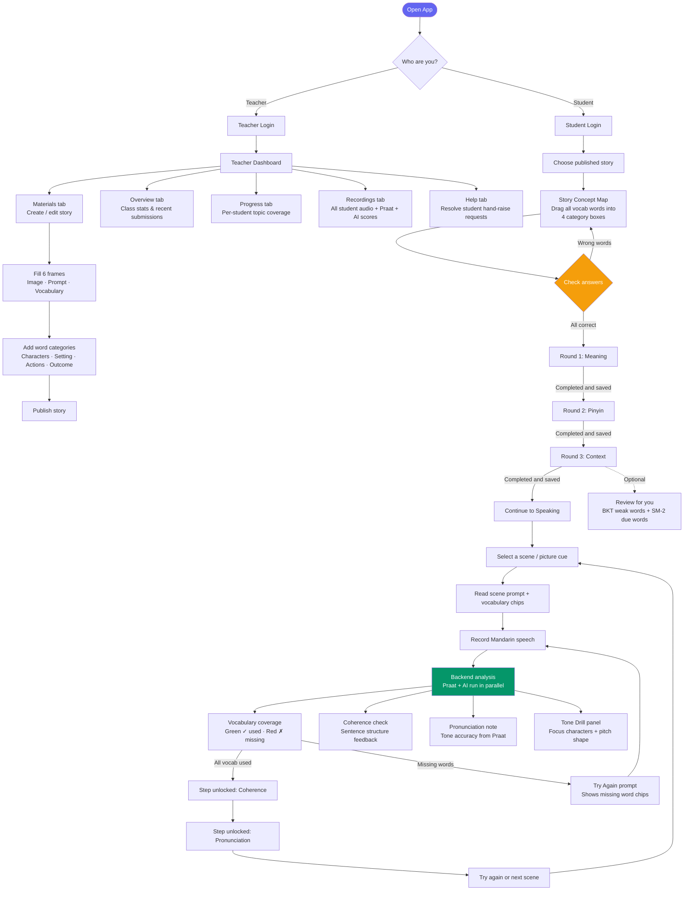
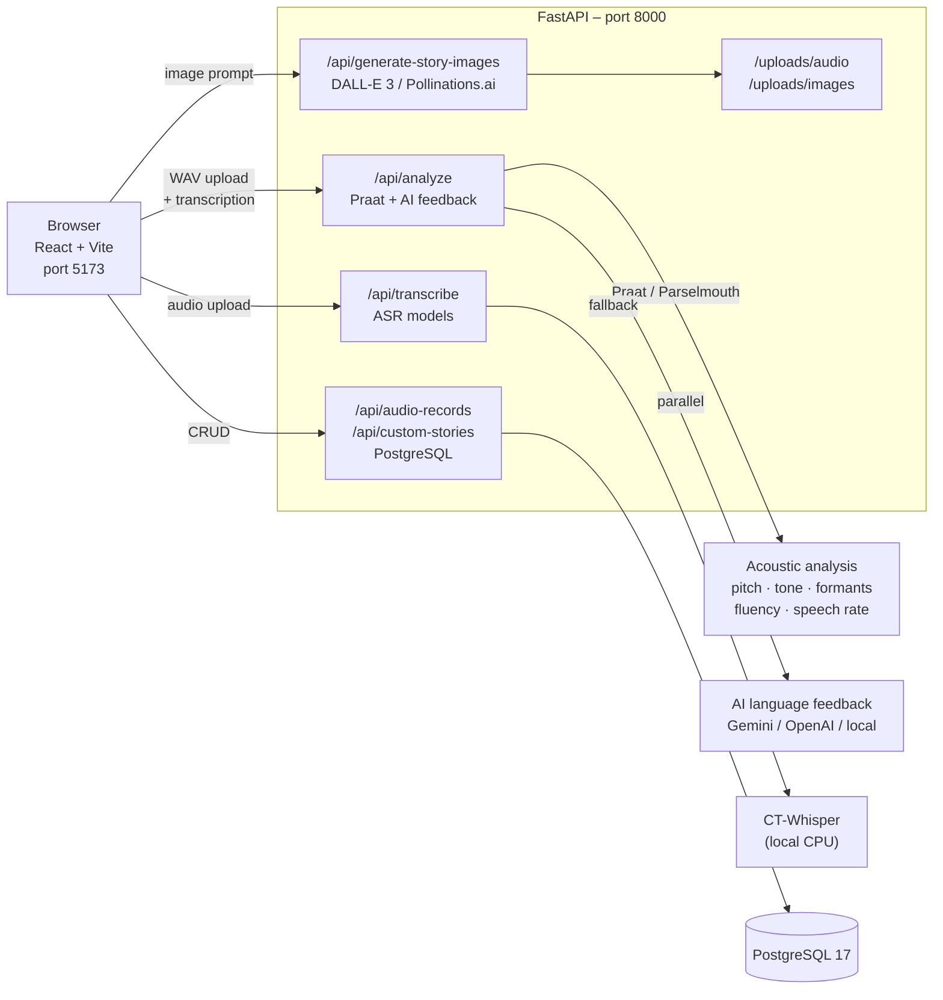
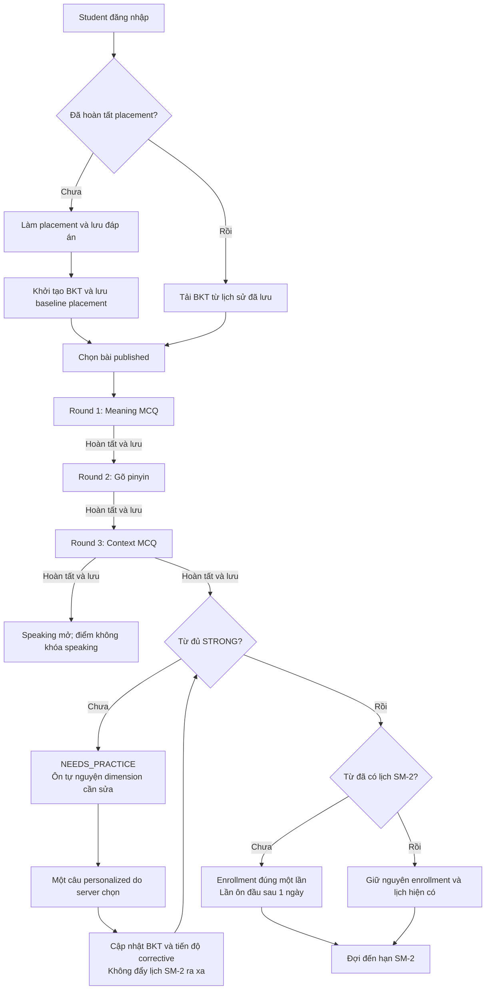
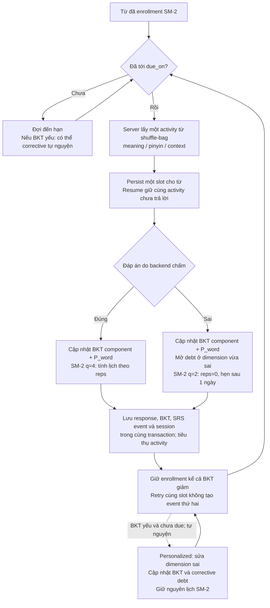

# 慢慢中文 · Mandarin, little by little

A classroom speaking-practice platform for Mandarin learners. Teachers build story activities with picture cues and vocabulary; students record Mandarin speech and receive acoustic + AI language feedback in real time.

---

## Application Flow


```mermaid
flowchart TD
    A([Open App]) --> B{Who are you?}

    B -->|Teacher| T1[Teacher Login]
    B -->|Student| S1[Student Login]

    %% ── Teacher path ──────────────────────────────────────
    T1 --> T2[Teacher Dashboard]

    T2 --> T3[Materials tab\nCreate / edit story]
    T3 --> T4[Fill 6 frames\nImage · Prompt · Vocabulary]
    T4 --> T5[Add word categories\nCharacters · Setting · Actions · Outcome]
    T5 --> T6[Publish story]

    T2 --> T7[Overview tab\nClass stats & recent submissions]
    T2 --> T8[Progress tab\nPer-student topic coverage]
    T2 --> T9[Recordings tab\nAll student audio + Praat + AI scores]
    T2 --> T10[Help tab\nResolve student hand-raise requests]

    %% ── Student path ──────────────────────────────────────
    S1 --> S2[Choose published story]
    S2 --> S3[Story Concept Map\nDrag all vocab words into\n4 category boxes]
    S3 --> S4{Check answers}
    S4 -->|Wrong words| S3
    S4 -->|All correct| S18[Round 1: Meaning]
    S18 -->|Completed and saved| S19[Round 2: Pinyin]
    S19 -->|Completed and saved| S20[Round 3: Context]
    S20 -->|Completed and saved| S5[Continue to Speaking]
    S20 -.->|Optional| S21[Review for you\nBKT weak words + SM-2 due words]

    S5 --> S6[Select a scene / picture cue]
    S6 --> S7[Read scene prompt + vocabulary chips]
    S7 --> S8[Record Mandarin speech]

    S8 --> S9[Backend analysis\nPraat + AI run in parallel]

    S9 --> S10[Vocabulary coverage\nGreen ✓ used · Red ✗ missing]
    S9 --> S11[Coherence check\nSentence structure feedback]
    S9 --> S12[Pronunciation note\nTone accuracy from Praat]
    S9 --> S13[Tone Drill panel\nFocus characters + pitch shape]

    S10 -->|All vocab used| S14[Step unlocked: Coherence]
    S14 --> S15[Step unlocked: Pronunciation]
    S15 --> S16[Try again or next scene]
    S16 --> S6

    S10 -->|Missing words| S17[Try Again prompt\nShows missing word chips]
    S17 --> S8

    style A fill:#6366f1,color:#fff
    style S4 fill:#f59e0b,color:#fff
    style S9 fill:#059669,color:#fff
```

---

## Architecture


```mermaid
flowchart LR
    Browser["Browser\nReact + Vite\nport 5173"]

    subgraph Backend["FastAPI  –  port 8000"]
        direction TB
        API["/api/analyze\nPraat + AI feedback"]
        ASR["/api/transcribe\nASR models"]
        DB["/api/audio-records\n/api/custom-stories\nPostgreSQL"]
        IMG["/api/generate-story-images\nDALL-E 3 / Pollinations.ai"]
        UPL["/uploads/audio\n/uploads/images"]
    end

    Browser -->|"WAV upload\n+ transcription"| API
    Browser -->|"audio upload"| ASR
    Browser -->|"CRUD"| DB
    Browser -->|"image prompt"| IMG

    API -->|"Praat / Parselmouth"| Praat["Acoustic analysis\npitch · tone · formants\nfluency · speech rate"]
    API -->|"parallel"| AIFeed["AI language feedback\nGemini / OpenAI / local"]
    IMG --> UPL
    ASR -->|"fallback"| CTW["CT-Whisper\n(local CPU)"]

    DB --> Postgres[(PostgreSQL 17)]
```

---

## Features

### Teacher tools
| Feature | Description |
|---|---|
| Story builder | Create 6-frame stories with image, student prompt, vocabulary, and word-category answer key |
| Word category editor | Assign each vocab word to Characters / Setting / Actions / Outcome for the drag-and-drop activity |
| AI image generation | Generate photorealistic scene images with DALL-E 3 or Pollinations.ai |
| Publish / unpublish | Control which stories appear in the student topic list |
| Export / Import story | Download a story as a single file and load it on another device — see [Exporting & Importing Stories](#exporting--importing-stories) |
| Dashboard | Class stats, help requests, progress per topic, all recordings with Praat + AI scores |
| Refresh recordings | Fetch latest student recordings from the backend without reloading the page |

### Student tools
| Feature | Description |
|---|---|
| Story Concept Map | Drag-and-drop vocab words into 4 categories; Check validates against teacher answer key |
| Scene practice | Record speech per picture cue; vocabulary chips show used ✓ / missing ✗ after analysis |
| Learning scaffold | Vocab → Coherence → Pronunciation; each step unlocks only when the previous is complete |
| Tone Drill panel | Focus characters with pitch contour shapes for targeted pronunciation practice |
| Recording playback | Listen back to your recording in the feedback panel |
| My Stories | Review all saved attempts with full Praat metrics and AI feedback |
| Raise hand | Send a help request to the teacher directly from the student view |

### Analysis pipeline
| Layer | What it measures |
|---|---|
| Praat / Parselmouth | Pitch contour, tone accuracy, formants, speech rate, fluency score, pause analysis |
| AI language coach | Vocabulary coverage (used / missing), coherence, pronunciation note, improved version |
| Tone drill | Per-word pitch shape classification (rising / falling / dipping / high-level) |

### Voice-feedback reliability gates

Automated feedback is only allowed to count toward learner progress when the recording contains
enough acoustic and transcript evidence. The backend runs a deterministic preflight before any
cloud model, then combines signal quality, voiced pitch, transcription, and target-word checks in
the `feedback_quality` field returned by `/api/analyze`.

| Status | Meaning | Student experience |
|---|---|---|
| `reliable` | Pronunciation and target content have enough independent evidence | Feedback may count toward progress, with the reminder that it remains practice guidance |
| `review` | Pronunciation is measurable but content or audio provenance is not fully verified | Feedback is shown as an estimate and does not unlock mastery |
| `retry` | The attempt is too short, quiet, clipped, mismatched, or lacks enough voiced pitch | Scores are withheld and the learner is prompted to record again |

Unjudged words and syllables use `judged: false` and `passed: null`; missing evidence is never
converted into a neutral or failing pronunciation score. After repeated uncertain attempts, the UI
directs the learner to ask a teacher for review.

### Feedback dimensions & the technology behind each

Every recording is scored across several dimensions. Some are **deterministic** acoustic
measurements (pure signal processing — same audio always yields the same number); others are
**AI** judgments from a language model. The table below maps each dimension to the engine that
produces it.

| Dimension | What it measures | Engine | Deterministic / AI |
|---|---|---|---|
| **Transcription (ASR)** | Speech → Mandarin text | Browser **Web Speech API** (default, Traditional Chinese) · or server ASR: **CT-Whisper** (`openai/whisper-small`, local) · or cloud (Groq / OpenAI / Gemini) | Model-dependent |
| **Tone accuracy** | How closely the pitch melody matches a Mandarin tone shape | **Praat / Parselmouth** pitch extraction → correlation (65%) + distance (35%) vs reference tone patterns (`chinese_tones.py`) | Deterministic |
| **Pitch contour & word prosody** | F0 over time; per-syllable rising / falling / dipping / level shape | **Praat / Parselmouth** | Deterministic |
| **Formants (F1 / F2 / F3)** | Vowel quality / resonance | **Praat / Parselmouth** formant tracking | Deterministic |
| **Speech rate** | Syllables per second | Character count ÷ utterance duration (**Praat**) | Deterministic |
| **Fluency** | Speaking fluency | **Praat** utterance fluency — phonation-time ratio, articulation rate, mean length of run (`caf_metrics.py`) + pitch-continuity term | Deterministic |
| **Pauses & utterances** | Pause count, longest pause, speech ratio | **Praat** intensity-based silence detection | Deterministic |
| **Vocabulary coverage** | Scene-word coverage + lexical richness | **LLM** (Gemini `gemini-2.0-flash` / OpenAI `gpt-4o-mini`) → local: task coverage blended with **lexical diversity** (Guiraud index, MTLD) | AI or CAF-local |
| **Coherence** | Grammatical completeness & clause linking | **LLM** (Gemini / OpenAI) → local: **syntactic complexity** (mean length of utterance + connective/subordination density) | AI or CAF-local |
| **Pronunciation note** | Holistic pronunciation, informed by Praat | **LLM** (Gemini / OpenAI) → local: tone-contour proxy for **Goodness of Pronunciation** + utterance-fluency notes | AI or CAF-local |
| **Improved version & practice prompt** | A model sentence + next actionable step | **LLM** (Gemini / OpenAI); local returns a targeted next-step drill | AI or CAF-local |

> The AI provider is set with `AI_FEEDBACK_PROVIDER` (`gemini` · `openai` · `local`). With no API
> key configured it falls back to `local`, so the app still runs fully offline. The local engine is
> **not** ad-hoc heuristics — the language-coaching dimensions are grounded in the
> Complexity–Accuracy–Fluency (CAF) tradition of L2 speaking assessment, computed deterministically
> in [`backend/caf_metrics.py`](backend/caf_metrics.py) (Chinese word segmentation via **jieba**).

#### References (local CAF engine)

- Skehan, P. (1998). *A Cognitive Approach to Language Learning.* OUP. — CAF framework.
- Housen, A., & Kuiken, F. (2009). Complexity, Accuracy and Fluency in SLA. *Applied Linguistics, 30*(4), 461–473.
- Towell, R., Hawkins, R., & Bazergui, N. (1996). The development of fluency in advanced learners of French. *Applied Linguistics, 17*(1), 84–119. — mean length of run.
- De Jong, N. H., et al. (2012). Facets of speaking proficiency. *SSLA, 34*(1), 5–34. — phonation-time ratio, articulation rate.
- Guiraud, P. (1960). *Problèmes et méthodes de la statistique linguistique.* — Guiraud index.
- McCarthy, P. M., & Jarvis, S. (2010). MTLD, vocd-D and HD-D: A validation study. *Behavior Research Methods, 42*(2), 381–392.
- Witt, S. M., & Young, S. J. (2000). Phone-level pronunciation scoring. *Speech Communication, 30*(2–3), 95–108. — Goodness of Pronunciation (tone-contour proxy used here).

#### Local engine: ad-hoc → paper-grounded

| Dimension | Before (ad-hoc) | Now (paper-grounded) | Technology behind the scenes | Source |
|---|---|---|---|---|
| **Vocabulary** | substring match only | task coverage blended with lexical diversity (Guiraud index, MTLD) | `jieba` word segmentation + Guiraud/MTLD in pure Python (`caf_metrics.py`) | Guiraud 1960; McCarthy & Jarvis 2010 |
| **Coherence** | character-count thresholds | syntactic complexity — mean length of utterance + connective/subordination density | `jieba` segmentation + connective lexicon, Python (`caf_metrics.py`) | Skehan 1998; Housen & Kuiken 2009 |
| **Fluency** | pitch-continuity heuristic | utterance fluency — phonation-time ratio, articulation rate, mean length of run | `praat-parselmouth` intensity/pause segmentation + NumPy (`praat_analyzer.py`, `caf_metrics.py`) | Towell et al. 1996; De Jong et al. 2012 |
| **Pronunciation** | tone threshold | tone-contour proxy for Goodness of Pronunciation + fluency notes | `praat-parselmouth` pitch extraction + NumPy/SciPy contour correlation (`chinese_tones.py`) | Witt & Young 2000 |

**Frontend rendering:** React + Vite, with **Chart.js** for the pitch-contour visualization.

---

## Vocabulary Learning Flow: BKT + SM-2

**BKT theo dõi kiến thức → từ đủ `STRONG` được đưa vào SM-2 → SM-2 quyết định khi nào ôn →
shuffle-bag chọn một loại câu hỏi → đáp án cập nhật BKT và lịch SM-2.**

Phần này mô tả **code hiện tại**, bao gồm các trường hợp đúng/sai. `STRONG` là trạng thái
của hệ thống, không phải bằng chứng rằng student đã nhớ từ vĩnh viễn.
`Dimension` là một phần kiến thức của từ: nghĩa, pinyin hoặc ngữ cảnh. `Corrective debt`
/ `unresolved dimension` là phần đã trả lời sai trong quá trình học và còn cần sửa;
`personalized/corrective` là luyện phần đó, còn `maintenance` là ôn từ đã đến hạn.

### 1. Placement, ba round và điều kiện vào SM-2


```mermaid
flowchart TD
    LOGIN["Student đăng nhập"] --> PLACED{"Đã hoàn tất placement?"}
    PLACED -->|Chưa| PLACEMENT["Làm placement và lưu đáp án"]
    PLACEMENT --> INIT["Khởi tạo BKT và lưu baseline placement"]
    PLACED -->|Rồi| LOAD["Tải BKT từ lịch sử đã lưu"]
    INIT --> LESSON["Chọn bài published"]
    LOAD --> LESSON
    LESSON --> R1["Round 1: Meaning MCQ"]
    R1 -->|Hoàn tất và lưu| R2["Round 2: Gõ pinyin"]
    R2 -->|Hoàn tất và lưu| R3["Round 3: Context MCQ"]
    R3 -->|Hoàn tất và lưu| SPEAK["Speaking mở; điểm không khóa speaking"]
    R3 -->|Hoàn tất và lưu| CHECK{"Từ đủ STRONG?"}
    CHECK -->|Chưa| WEAK["NEEDS_PRACTICE<br/>Ôn tự nguyện dimension cần sửa"]
    WEAK --> PRACTICE["Một câu personalized do server chọn"]
    PRACTICE --> UPDATE["Cập nhật BKT và tiến độ corrective<br/>Không đẩy lịch SM-2 ra xa"]
    UPDATE --> CHECK
    CHECK -->|Rồi| EXISTING{"Từ đã có lịch SM-2?"}
    EXISTING -->|Chưa| ENROLL["Enrollment đúng một lần<br/>Lần ôn đầu sau 1 ngày"]
    EXISTING -->|Rồi| KEEP["Giữ nguyên enrollment và lịch hiện có"]
    ENROLL --> SRS["Đợi đến hạn SM-2"]
    KEEP --> SRS
```

Placement khởi tạo kiến thức của từng student; không tự fit lại sáu tham số BKT cho mỗi
account mới. Với từ được hỏi trực tiếp, đáp án placement được replay từ prior chung.
Với từ chưa được hỏi, kết quả placement hợp lệ cùng chương có thể khởi tạo prior.
Lỗi placement không tạo corrective debt, và placement không thay thế ba round của bài học.

| Round | Student làm gì với từng từ? | BKT component nhận evidence | Điều kiện sang bước tiếp |
|---|---|---|---|
| 1 — Meaning | Chọn nghĩa đúng (`basic_meaning_mcq`) | `meaning` | Hoàn tất round và lưu attempt; không cần đạt tỷ lệ đúng cố định |
| 2 — Pinyin | Tự gõ pinyin (`character_to_pinyin_typing`) | `pinyin` | Hoàn tất round và lưu attempt |
| 3 — Context | Chọn từ phù hợp ngữ cảnh (`context_cloze_mcq`) | `context` | Hoàn tất round và lưu attempt để mở speaking |

Mỗi round diagnostic dùng câu hỏi published cho các từ trong bài; số câu theo vocabulary
của bài, không cố định 20/22/25 câu. Round 1 và 2 không có giới hạn thời gian toàn round;
Round 3 hiện có giới hạn 150 giây trên giao diện. Backend vẫn kiểm tra coverage hợp lệ:
hết timer hoặc có một đáp án đúng không tự chứng minh rằng cả diagnostic đã đầy đủ.

Student có thể hoàn tất cả ba round dù có đáp án sai và tiếp tục speaking.
Điều kiện mở speaking và điều kiện enrollment SM-2 là hai kiểm tra riêng.
Sau mỗi đáp án được server lưu/xác nhận, BKT được cập nhật; không cần chờ hết ba round
mới bắt đầu tính. Gate enrollment chỉ mở khi diagnostic của bài đã đầy đủ.

**Cách đọc BKT hiện tại:** mỗi student × canonical word ID có ba mastery state riêng:
`P_meaning`, `P_pinyin`, `P_context`. Ngoài ra, code giữ `P_word`, là xác suất pooled replay
từ toàn bộ evidence hợp lệ của từ, để dùng cho gate `STRONG` hiện có.
Một đáp án cập nhật component được hỏi và `P_word`; hai component còn lại giữ nguyên khi
prior và bộ tham số không đổi. **Gate hiện tại chưa yêu cầu cả ba component riêng đều ≥ 0,95.**

Từ đủ điều kiện enrollment khi đồng thời thỏa mãn:

- Bài đã hoàn tất đủ ba round diagnostic hợp lệ; từ có evidence ở cả ba dimension.
- Có ít nhất 3 observation BKT hợp lệ sau khi deduplicate exposure.
- `P_word ≥ mastery_threshold` (ngưỡng mặc định hiện tại: `0,95`).
- Không còn dimension unresolved từ lỗi trong quá trình học/ôn.

Do đó, `P_word` cao sau Round 2 vẫn chưa đủ để enrollment. Nếu đúng cả ba round, không có
lỗi học cũ và đã đạt ngưỡng, từ chuyển `STRONG` rồi enrollment ngay khi backend xác nhận;
không bắt làm thêm corrective. Placement và lịch sử trước đó có thể làm xác suất khác nhau.

### 2. Nếu sai Round 1, Round 2 hoặc Round 3

Sai dimension nào thì mở yêu cầu sửa dimension đó. Student không phải làm lại cả ba round
để sửa một từ. Bảng giả định từ chưa có lỗi học cũ; số câu bổ sung là **tối thiểu để sửa
corrective debt**, khi mọi corrective tiếp theo đều đúng.

| Round 1 | Round 2 | Round 3 | Dimension cần sửa | Corrective success cần có |
|---|---|---|---|---|
| Đúng | Đúng | Đúng | Không | 0; enrollment nếu các gate khác cũng đạt |
| Sai | Đúng | Đúng | Meaning | 2 câu meaning đúng |
| Đúng | Sai | Đúng | Pinyin | 2 câu pinyin đúng |
| Đúng | Đúng | Sai | Context | 2 câu context đúng |
| Sai | Sai | Đúng | Meaning + pinyin | 2 câu đúng cho mỗi dimension, tổng 4 |
| Sai | Đúng | Sai | Meaning + context | 2 câu đúng cho mỗi dimension, tổng 4 |
| Đúng | Sai | Sai | Pinyin + context | 2 câu đúng cho mỗi dimension, tổng 4 |
| Sai | Sai | Sai | Cả ba | 2 câu đúng cho mỗi dimension, tổng 6 |

Hai success được tính trong **cùng từ và cùng dimension**, và có thể tích lũy qua nhiều
phiên. Ví dụ pinyin: `sai → corrective đúng (1/2) → corrective sai (reset 0/2) →
corrective đúng (1/2) → corrective đúng (đã sửa)`. Đáp án của từ khác hoặc dimension khác
không cộng và không reset tiến độ pinyin đó.

Hết debt nhưng `P_word` vẫn dưới ngưỡng thì từ còn cần evidence. Server chọn dimension
cần củng cố; speaking vẫn mở. Luyện lại đúng item diagnostic cũ có exposure deduplication,
nên không tương đương một corrective observation mới.

### 3. Từ đã vào SM-2: khi nào ôn và chọn loại câu hỏi nào?


```mermaid
flowchart TD
    ENROLLED["Từ đã enrollment SM-2"] --> DUE{"Đã tới due_on?"}
    DUE -->|Chưa| WAIT["Đợi đến hạn<br/>Nếu BKT yếu: có thể corrective tự nguyện"]
    WAIT --> DUE
    DUE -->|Rồi| BAG["Server lấy một activity từ shuffle-bag<br/>meaning / pinyin / context"]
    BAG --> SLOT["Persist một slot cho từ<br/>Resume giữ cùng activity chưa trả lời"]
    SLOT --> ANSWER{"Đáp án do backend chấm"}
    ANSWER -->|Đúng| PASS["Cập nhật BKT component + P_word<br/>SM-2 q=4: tính lịch theo reps"]
    ANSWER -->|Sai| FAIL["Cập nhật BKT component + P_word<br/>Mở debt ở dimension vừa sai<br/>SM-2 q=2: reps=0, hẹn sau 1 ngày"]
    PASS --> SAVE["Lưu response, BKT, SRS event và session<br/>trong cùng transaction; tiêu thụ activity"]
    FAIL --> SAVE
    SAVE --> RETAIN["Giữ enrollment kể cả BKT giảm<br/>Retry cùng slot không tạo event thứ hai"]
    RETAIN --> DUE
    RETAIN -.->|BKT yếu và chưa due; tự nguyện| REPAIR["Personalized: sửa dimension sai<br/>Cập nhật BKT và corrective debt<br/>Giữ nguyên lịch SM-2"]
    REPAIR --> RETAIN
```

SM-2 giữ **một lịch cho cả từ**, không tạo ba lịch meaning/pinyin/context riêng.
Khi đến hạn, server tạo đúng một câu hỏi cho từ, bằng một activity từ shuffle-bag riêng
của student × word. Không dùng component có `P(L)` thấp nhất để chọn activity due.

Ví dụ một bag được xáo thành `pinyin → context → meaning`: ba lần ôn đến hạn tiếp theo
dùng lần lượt ba loại đó, rồi mới xáo bag mới. Bag mới có thể là
`meaning → pinyin → context`; lặp ở **ranh giới giữa hai bag** vẫn có thể xảy ra.
Sự cân bằng được đảm bảo trong mỗi chu kỳ ba activity đã trả lời, không phải giữa mọi
hai lần ôn liên tiếp hoặc giữa tất cả các từ trong cùng phiên.

Seed, cycle, order, remaining và pending activity được lưu trên server. Trả lời đúng hoặc
sai đều tiêu thụ một activity sau khi response đã lưu thành công. Đóng/resume phiên trước
khi trả lời không tiêu thụ thêm activity và không đổi lịch. Request lỗi/stale không được
chấm thành sai; retry cùng slot không cộng thêm evidence hoặc SRS event.

Phiên “Ôn dành cho bạn” lấy từ các bài published đã hoàn tất diagnostic, gộp `due` và
`weak` theo canonical word ID. Một từ vừa due vừa weak được xử lý **một lần dưới dạng due**.
Khi chưa due, từ yếu có thể được chọn làm corrective; corrective chỉ cập nhật BKT và debt.
Session hiện lấy tối đa 12 từ/câu, mỗi từ xuất hiện tối đa một lần trong phiên, trộn
`due:weak` khoảng `2:1` nếu đủ dữ liệu. Hai giới hạn này là policy UX đang triển khai;
không phải số suy ra từ BKT/SM-2 hay ngưỡng tối ưu đã được kiểm chứng.

### 4. Ví dụ ngày ôn: đúng liên tục, sai ngày đầu, sai lặp lại

Trong các bảng dưới, **Ngày 0 là thời điểm từ vừa đủ `STRONG` và được enrollment**.
Student trả lời đúng thời điểm đến hạn. Một ngày là 24 giờ trong production; nếu enrollment
lúc 09:00 thì lần đầu due lúc 09:00 hôm sau, không tự due từ 00:00.

Enrollment tạo `reps=1`, `ease=2,50`, `interval=1`, `due_on=Ngày 1`. Đây là sự kiện
enrollment, không phải một câu maintenance giả. Scheduler đang dùng modified SM-2:

- `interval`: số ngày phải chờ từ lần review vừa diễn ra tới lần tiếp theo.
- `ease`: hệ số giãn khoảng cách; sai làm hệ số này giảm để các lần ôn xa hơn gần lại.
- `reps`: bộ đếm của scheduler, tăng khi maintenance đúng và reset về 0 khi sai.
  Vì enrollment khởi tạo `reps=1`, nó không phải tổng số câu student đã trả lời đúng.

| Đáp án maintenance | Quy tắc lịch tiếp theo |
|---|---|
| Đúng (`q=4`), `reps` trước đáp án bằng 0 | Interval = 1 ngày; `reps` thành 1 |
| Đúng (`q=4`), `reps` trước đáp án bằng 1 | Interval = 6 ngày; `reps` thành 2 |
| Đúng (`q=4`), `reps` trước đáp án ≥ 2 | Interval = `max(1, round(interval cũ × ease trước đáp án))`; `reps` tăng 1 |
| Sai (`q=2`) ở bất kỳ lần nào | Interval = 1 ngày; `reps=0`; ease giảm 0,32, tối thiểu 1,30 |

`q=4` giữ ease hiện tại; thời gian trả lời không thay đổi quality grade.
**Due mới luôn bằng thời điểm vừa review + interval mới.**

**A. Đúng mọi lần:**

| Ngày trả lời | Kết quả | `reps` sau đáp án | Ease | Interval mới | Due tiếp theo |
|---|---|---|---|---|---|
| 0 | Enrollment | 1 | 2,50 | 1 ngày | Ngày 1 |
| 1 | Đúng | 2 | 2,50 | 6 ngày | Ngày 7 |
| 7 | Đúng | 3 | 2,50 | 15 ngày | Ngày 22 |
| 22 | Đúng | 4 | 2,50 | 38 ngày | Ngày 60 |

Vì vậy, `1 → 6 → 15 → 38` là **khoảng cách giữa các lần ôn**, còn `1 → 7 → 22 → 60`
là các mốc ngày tính từ enrollment.

**B. Sai ở Ngày 1, sau đó đúng:**

| Ngày trả lời | Kết quả | `reps` sau đáp án | Ease | Interval mới | Due tiếp theo |
|---|---|---|---|---|---|
| 1 | Sai | 0 | 2,18 | 1 ngày | Ngày 2 |
| 2 | Đúng | 1 | 2,18 | 1 ngày | Ngày 3 |
| 3 | Đúng | 2 | 2,18 | 6 ngày | Ngày 9 |
| 9 | Đúng | 3 | 2,18 | 13 ngày | Ngày 22 |

Giả sử bag là `pinyin → context → meaning`: Ngày 1 sai pinyin sẽ mở debt pinyin;
Ngày 2 hỏi context và Ngày 3 hỏi meaning. Từ vẫn enrolled và đến hạn dù BKT giảm.
Student có thể sửa pinyin bằng hai corrective success khi từ chưa due, qua các phiên
ngắn. Những corrective đó không đổi due Ngày 2/3/9.

**Maintenance đúng không được tính là corrective success trong policy hiện tại.**
Ngay cả khi lần due sau hỏi pinyin và student trả lời đúng, BKT pinyin tăng và SM-2 cập
nhật, nhưng debt pinyin vẫn cần hai success ở activity `personalized_practice` để đóng.
Vì vậy, từ có thể vừa có lịch SM-2 đang chạy vừa có trạng thái BKT/review `NEEDS_PRACTICE`.

**C. Sai cả Ngày 1 và Ngày 2:**

| Ngày trả lời | Kết quả | `reps` sau đáp án | Ease | Interval mới | Due tiếp theo |
|---|---|---|---|---|---|
| 1 | Sai | 0 | 2,18 | 1 ngày | Ngày 2 |
| 2 | Sai | 0 | 1,86 | 1 ngày | Ngày 3 |
| 3 | Đúng | 1 | 1,86 | 1 ngày | Ngày 4 |
| 4 | Đúng | 2 | 1,86 | 6 ngày | Ngày 10 |
| 10 | Đúng | 3 | 1,86 | 11 ngày | Ngày 21 |

Nếu hai lần sai hỏi hai dimension khác nhau, mỗi dimension có debt riêng. Sai lại cùng
dimension reset corrective progress của dimension đó; không reset debt của từ khác.

**D. Ban đầu đúng, rồi sai ở lần ôn xa hơn:** Ngày 1 đúng → due Ngày 7. Ngày 7 sai →
`reps=0`, ease `2,18`, due Ngày 8. Ngày 8 đúng → due Ngày 9. Ngày 9 đúng → due Ngày 15.
Student chỉ sửa dimension vừa sai; không phải học lại toàn bộ ba round và không re-enroll từ.

Nếu student bỏ lỡ Ngày 7, từ vẫn overdue; chưa có đáp án thì BKT và lịch chưa cập nhật.
Ví dụ theo nhánh A, đến Ngày 10 mới trả lời đúng lần đó thì interval mới là 15 ngày,
due mới ở **Ngày 25**, tính từ lần review thực tế.

### 5. Code dùng để đối chiếu và giới hạn diễn giải

| Phần logic | Nguồn trong repo |
|---|---|
| Loại câu hỏi ba round và mở speaking theo completion | [`progression.ts`](frontend/src/entities/vocabulary/progression.ts) |
| Prior từ placement | [`placement_prior.py`](backend/analytics/learner_model/bkt/placement_prior.py) |
| Replay BKT theo component và xác suất pooled của từ | [`mastery.py`](backend/analytics/learner_model/bkt/mastery.py) |
| Gate `STRONG`, unresolved dimension và hai corrective success | [`vocabulary_state.py`](backend/analytics/learner_model/vocabulary_state.py) |
| Công thức interval, ease và quality của SM-2 | [`srs.py`](backend/analytics/learner_model/srs.py) |
| Enrollment, SRS event và shuffle-bag đã persist | [`srs_store.py`](backend/analytics/learner_model/srs_store.py) |
| Session, activity selection, response identity và transaction | [`vocab_review_session_service.py`](backend/services/vocab_review_session_service.py) |
| Gộp due/weak, diagnostic gate theo từng bài | [`review_queue.py`](backend/analytics/learner_model/review_queue.py) |

Các ví dụ lịch dùng `modified-sm2-v1` và ngày production 24 giờ; cấu hình development có
thể nén ngày để demo. Xác suất BKT thực tế phụ thuộc prior, lịch sử và bộ tham số đang
active. Ngưỡng `0,95` và hai corrective success là policy hiện tại; không có nghĩa student
có 95% khả năng trả lời đúng câu tiếp theo hoặc đã nhớ lâu dài. Meaning MCQ đo nhận biết
nghĩa, typed pinyin đo khả năng gõ pinyin, context MCQ đo chọn từ trong ngữ cảnh; kết quả
ba round không thay thế đánh giá speaking bằng âm thanh.

### Speaking practice — the pronunciation mastery gate

Each scene recording is scored **per syllable** (directional pitch check against the
expected tone, `backend/praat_analyzer.py`): a word passes only if its *weakest* syllable
clears the bar — an average can't hide one wrong-direction tone.

- Words that fail show ✗ chips per character; the student drills each failed word alone
  (`WordPracticeDrill`), then must **re-record the whole sentence** — words first, then
  the sentence.
- *Next scene*, *View summary*, and *Submit* stay locked until the latest full-sentence
  recording passes every word; the old 4-attempts escape hatch no longer bypasses
  failing words.

---

## Exporting & Importing Stories

A teacher story (its images, prompts, vocabulary, and — for Listen & Retell — listening
audio) can be saved to a single file and loaded on a different device, even one with its
own separate backend/database. This is handled entirely in the browser: exporting inlines
any server-hosted images/audio as base64 so the file has no dependency on the original
backend, and importing sends the story through the same save path as creating one by hand.

### Export (device A)

1. Log in as **Teacher** and open the **Materials** tab of the dashboard.
2. Find the story in the **Teacher Story Library** list on the right.
3. Click **Export** on that story.
4. Your browser downloads a file named `<story-title>.mandarin-story.json`. Send it to the
   other device however is convenient — USB drive, email, cloud storage, AirDrop, etc.

### Import (device B)

1. Log in as **Teacher** and open the **Materials** tab of the dashboard.
2. Click **Import story** next to the "Teacher Story Library" heading and pick the
   `.mandarin-story.json` file from step 4 above.
3. The story appears at the top of the library as a new, unpublished draft — review it,
   click **Edit** to tweak anything, then **Publish** when it's ready for students.

**Notes**

- Imported stories always land unpublished, so they never appear to students before you've
  reviewed them.
- The export is self-contained (images/audio are embedded as base64), so it works even if
  device B has no network access to device A's backend. The trade-off is file size — a
  story with several images can be a few megabytes.
- If device B is running fully offline (no backend reachable), the import still works and
  is cached in the browser's local storage, but very large exports can hit the browser's
  ~5 MB local-storage quota. Connecting device B to a backend avoids that limit.

---

## Quick Start

### Independent device development

Every device runs the same Docker stack independently. There is no
Lab/Laptop/Standalone mode and no device-to-device backend connection. Each
device owns its own PostgreSQL database, uploads, login accounts, model cache,
and Docker volumes.

Student and teacher login are separate entry points: students use
`http://127.0.0.1:5177/`, while teachers use
`http://127.0.0.1:5177/teacher.html`. The Student app does not show the
Listen & Retell section. Both roles can stay signed in and work at the same
time; signing out one role does not sign out the other.

#### Step 1 — Install prerequisites

Install Docker Desktop with Docker Compose, then clone or pull this repository
on the device. Run all commands below from the repository root.

#### Step 2 — Create the local environment file

Run this once per device:

```powershell
if (-not (Test-Path backend/.env)) { Copy-Item backend/.env.example backend/.env }
```

Keep a separate `backend/.env` on each device. Set a real local
`JWT_SECRET_KEY` and `ADMIN_PASSWORD`; never commit API keys or `.env` files.

#### Step 3 — Validate and start the stack

The start script validates Compose, reuses existing backend/frontend images, starts
PostgreSQL, runs Alembic migrations, and starts the backend and Vite frontend. On a
new checkout, Docker Compose builds any missing images automatically.

```powershell
.\start.ps1 -Detached
```

For foreground logs instead, use `.\start.ps1`. The first frontend request can
take a few seconds while Vite compiles the development bundle.

#### Step 4 — Confirm containers and migration

```powershell
docker compose -f docker-compose.dev.yml ps
docker compose -f docker-compose.dev.yml exec backend python -m alembic current
```

Expected results are backend/database `healthy` and migration `0019 (head)`.
Also check:

- Frontend: `http://127.0.0.1:5177`
- Backend readiness: `http://127.0.0.1:8001/health/ready`

The readiness response should report HTTP `200`, `database: "ok"`, and
`storage: "ok"`.

#### Step 5 — Seed teaching data

Seeding is explicit and idempotent. Run it after the backend is healthy:

```powershell
# Packaged materials + teaching data + demo accounts in one idempotent command
docker compose -f docker-compose.dev.yml exec backend python -m scripts.seed_dev
```

The repository now contains the recovered 18-material fixture and its 162
referenced teaching images. The seed restores those images into the Docker
upload volume as well as inserting the database rows. Local demo accounts use
password `123456`. The seed never changes existing materials or account
passwords by default. For a deliberate fixture/material replacement, add
`--overwrite`.
The Lessons 5–8 story seed bundle and specialist image seed were retired and removed; only the remaining development lessons are seeded.

No new Alembic migration is required for this recovery: the database schema is
already at `0019 (head)`; materials are versioned application seed data.

Existing lessons are not overwritten. Use `--overwrite` only when intentionally
replacing authored content.

#### Step 6 — Develop and test

Backend and frontend source folders are mounted into Docker, so edits reload.
Useful commands:

```powershell
# Follow backend and frontend logs
docker compose -f docker-compose.dev.yml logs -f backend frontend

# Run frontend tests inside the frontend container
docker compose -f docker-compose.dev.yml exec frontend npm test -- --run

# Run the frontend integration flows only
docker compose -f docker-compose.dev.yml exec frontend npm run test:integration

# Rebuild only after changing dependencies or Dockerfiles
.\start.ps1 -Build -Detached

# Optional: remove dangling images labelled for this project only.
# This never removes images, containers, or volumes from another project.
.\start.ps1 -PruneDangling -Detached
```

`-NoBuild` remains accepted for scripts that already use it, but reusing existing
images is now the default. The development source folders are bind-mounted, so normal
backend and frontend code edits hot reload without rebuilding.

To watch only the frontend and backend logs in the terminal while the stack runs in
detached mode:

```powershell
.\scripts\logs-dev.ps1
```

Press `Ctrl+C` to stop watching; it does not stop the containers. Development backend
logs are also written to `/data/logs/app.log` inside the persistent backend data volume.

#### Step 6.1 — Temporary public demo with Tailscale Funnel

Use this only for a demo or a short classroom test. The current Docker stack
already serves the frontend on `127.0.0.1:5177` and Vite proxies `/api` to the
backend, so this workflow does not need a separate Nginx container.

Install Tailscale, sign in, and run from the repository root:

```powershell
.\scripts\start-demo-funnel.ps1
```

The script checks the local stack, starts it if needed, and prints a temporary
public HTTPS URL such as `https://your-device.<tailnet>.ts.net`. Anyone with
the URL can reach the demo; they do not need Tailscale installed. Tailscale
Funnel provides the HTTPS certificate, but the URL remains tied to the
Tailscale device/tailnet and Funnel has non-configurable bandwidth limits, so
do not use this as the production deployment for a 50-user class.

Stop public access when the demo ends:

```powershell
.\scripts\start-demo-funnel.ps1 -Stop
```

See the [Tailscale Funnel documentation](https://tailscale.com/kb/1223/funnel)
for tailnet approval and current service limitations.

#### Step 7 — Stop or reset one device

Stop while preserving database/uploads:

```powershell
docker compose -f docker-compose.dev.yml down
```

Reset this device completely, including its database, uploads, model cache, and
Node dependencies:

```powershell
.\start.ps1 -ResetData -Detached
```

Use `-ResetData` only when intentionally resetting that device.

#### Important data-safety rule

Never run `docker compose down -v` unless you intentionally want to delete the
local PostgreSQL volume. Use `docker compose down` to stop containers while
preserving data.

All configuration is local to the device and is not synchronized through
GitHub. Do not commit real API keys or local `.env` files.

### Public deployment

`render.yaml` uses a single-origin production image, PostgreSQL, HTTPS cookies,
and a persistent `/data` disk for uploads. Configure the unsynchronised
`JWT_SECRET_KEY` and `ADMIN_PASSWORD` secrets in Render before deploying.
Production application, Uvicorn error, and HTTP access logs are written to
`/data/logs/app.log` with five 10 MB rotated backups. The `/data` disk must
remain persistent if those file logs need to survive a container replacement;
the hosting provider's own log viewer remains useful for live monitoring.
The production image requires `APP_ENV=production`, `COOKIE_SECURE=true`, and
does not allow anonymous roster creation, lesson writes, analytics, AI calls,
or media downloads. The blueprint uses a paid persistent-disk web service and
`basic-256mb` PostgreSQL; increase the web plan after a 50-user load test.

### Advanced operations

Migration, reset, testing, and troubleshooting details are in
[Quick Start](#quick-start) above — the Docker workflow there is the
supported path for a clean checkout.

### Environment variables

Start with `backend/.env.example`. Docker overrides the database and storage
paths inside the Compose network. Keep `backend/.env` local and never commit
secrets.

Student and teacher accounts are provisioned by an admin with an individual
password. Local demo accounts are the only documented use of `123456`.
Production rejects that default and requires a password of at least 8 characters.
Production serves frontend and backend from one origin;
do not deploy the old separate GitHub Pages/Vercel frontend configuration.

## Project Structure

```
.
├── backend/
│   ├── ai_feedback.py        # Gemini / OpenAI / local language feedback
│   ├── chinese_tones.py      # Mandarin tone reference patterns
│   ├── database.py           # PostgreSQL (psycopg3) helpers
│   ├── main.py               # FastAPI routes, image generation, parallel analysis
│   ├── praat_analyzer.py     # Parselmouth acoustic analysis
│   ├── scripts/seed_dev.py   # Shared local lesson + demo-account seed
│   ├── scripts/data/assets/  # Versioned teaching images restored by the seed
│   ├── Dockerfile
│   └── requirements.txt
├── frontend/
│   ├── src/                   # React pages, components, services and tests
│   ├── public/                # Static frontend assets
│   ├── package.json           # Frontend-only Node workspace
│   ├── vite.config.ts
│   └── Dockerfile.frontend.dev
└── docker-compose.dev.yml      # Independent local stack
```

---

## API Reference

| Method | Endpoint | Description |
|---|---|---|
| `GET` | `/health` | Backend status |
| `POST` | `/api/analyze` | WAV upload → Praat + AI feedback |
| `POST` | `/api/transcribe` | WAV upload → transcription (groq / openai / gemini / ctwhisper) |
| `GET` | `/api/audio-records` | List all student recordings |
| `POST` | `/api/audio-records/upload` | Save a recording with audio file |
| `DELETE` | `/api/audio-records/{id}` | Delete a recording |
| `GET` | `/api/custom-stories` | List teacher stories |
| `POST` | `/api/custom-stories` | Create / update a story |
| `DELETE` | `/api/custom-stories/{id}` | Delete a story |
| `POST` | `/api/generate-story-images` | Generate 6 picture cues with AI |
| `GET` | `/api/reference-tone/{tone}` | Mandarin tone reference (1–4) |
| `GET` | `/api/all-tones` | All tone reference patterns |

---

## Praat Metrics

| Metric | Description |
|---|---|
| Tone accuracy | Similarity of pitch contour to Mandarin tone references |
| Fluency score | Smoothness and continuity from pitch and timing |
| Speech rate | Estimated syllables per second |
| Pitch contour | Frequency over time (Hz) |
| Formants F1 / F2 / F3 | Vowel resonance characteristics |
| Pause analysis | Utterance count, pause count, longest pause, speech ratio |
| Word prosody | Per-word pitch shape: rising / falling / dipping / high-level |

---

## Troubleshooting

If the backend is unavailable, run `docker compose -f docker-compose.dev.yml ps`
and wait for `backend` to become `healthy`. Then check
`http://127.0.0.1:8001/health/ready`. For other setup issues, see
[Quick Start](#quick-start) above.

---

## License

MIT
